# UltronSolar - System Architecture Documentation

## Table of Contents
- [Overview](#overview)
- [System Architecture](#system-architecture)
- [Technology Stack](#technology-stack)
- [Application Structure](#application-structure)
- [Data Flow Architecture](#data-flow-architecture)
- [Integration Architecture](#integration-architecture)
- [Deployment Architecture](#deployment-architecture)

---

## Overview

UltronSolar is a modern Next.js 15 web application serving as a digital lead-generation platform for Ultron Power Systems, a solar energy solutions company in North Maharashtra, India. The platform combines AI-powered tools, interactive calculators, and seamless lead management to convert visitors into qualified solar customers.

### Key Metrics
- 50+ Installations Completed
- 56+ Customer Reviews
- Operating Since 2006
- Multi-language Support (EN, HI, MR)

---

## System Architecture

### High-Level Architecture

```mermaid
graph TB
    subgraph "Client Layer"
        A[Web Browser]
        B[Mobile Browser]
    end

    subgraph "Frontend - Next.js 15 App"
        C[React Components]
        D[Context Providers]
        E[Client-Side State]
        F[LocalStorage]
    end

    subgraph "API Layer - Next.js Routes"
        G[/api/contact]
        H[/api/chat]
        I[/api/rag]
        J[/api/solar/estimate]
        K[/api/bill-extract]
        L[/api/building-insights]
        M[/api/geocode]
    end

    subgraph "External Services"
        N[OpenAI API]
        O[Google Generative AI]
        P[NREL PVWatts API]
        Q[Google Maps API]
        R[Gmail SMTP]
        S[WhatsApp Business]
    end

    subgraph "Data Storage"
        T[File System - Markdown]
        U[Browser Storage]
    end

    A --> C
    B --> C
    C --> D
    D --> E
    E --> F
    C --> G
    C --> H
    C --> J
    C --> K
    C --> L
    C --> M
    H --> I
    H --> N
    I --> T
    G --> R
    G --> S
    K --> O
    J --> P
    L --> Q
    M --> Q

    style A fill:#e1f5ff
    style B fill:#e1f5ff
    style C fill:#fff4e6
    style N fill:#c8e6c9
    style O fill:#c8e6c9
    style P fill:#c8e6c9
    style Q fill:#c8e6c9
    style R fill:#c8e6c9
    style S fill:#c8e6c9
```

---

## Technology Stack

### Core Technologies Breakdown

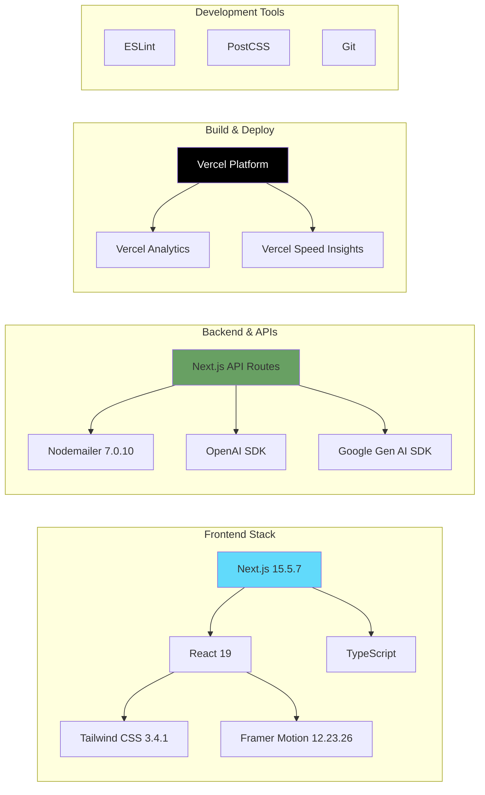

### Technology Version Matrix

| Category | Technology | Version | Purpose |
|----------|-----------|---------|---------|
| Framework | Next.js | 15.5.7 | Full-stack React framework |
| Language | TypeScript | Latest | Type-safe development |
| Styling | Tailwind CSS | 3.4.1 | Utility-first CSS framework |
| Animation | Framer Motion | 12.23.26 | Smooth animations & transitions |
| AI (Chat) | OpenAI | Latest | GPT-4o-mini chatbot |
| AI (Vision) | Google Gen AI | Latest | Bill extraction (Gemini) |
| Email | Nodemailer | 7.0.10 | Lead email delivery |
| Deployment | Vercel | Cloud | Serverless hosting |
| Analytics | Vercel Analytics | Latest | User behavior tracking |

---

## Application Structure

### Directory Architecture

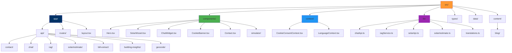

### Component Hierarchy

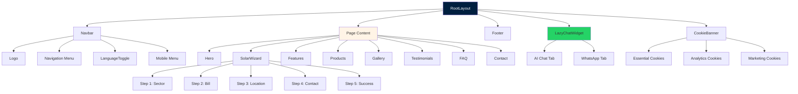

---

## Data Flow Architecture

### Lead Generation Flow

```mermaid
flowchart TD
    A[Visitor Lands] --> B{Entry Point?}

    B -->|Homepage| C[Hero Banner]
    B -->|Direct Link| D[Solar Wizard]
    B -->|SEO/Ads| E[Service Pages]

    C --> F[Trust Signals]
    F --> G[Solar Wizard Opens]

    G --> H[Step 1: Select Sector]
    H --> I[Step 2: Enter Bill Amount]
    I --> J[Step 3: Choose Location]
    J --> K[Step 4: Contact Details]
    K --> L[Step 5: Confirmation]

    L --> M{Lead Submission}
    M -->|POST| N[/api/contact]

    N --> O[Nodemailer Service]
    O --> P[Send Email to Business]
    O --> Q[Send Auto-reply to Customer]

    P --> R[ultronvij@gmail.com]

    L --> S[WhatsApp Integration]
    S --> T[wa.me/ Deep Link]
    T --> U[WhatsApp Chat Opens]

    E --> V[Contact Form]
    V --> N

    style A fill:#e1f5ff
    style G fill:#fff4e6
    style M fill:#ffccbc
    style N fill:#ff9933
    style R fill:#4CAF50
    style U fill:#25D366
```

### Solar Estimation Flow

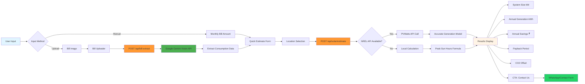

### AI Chat Flow with RAG

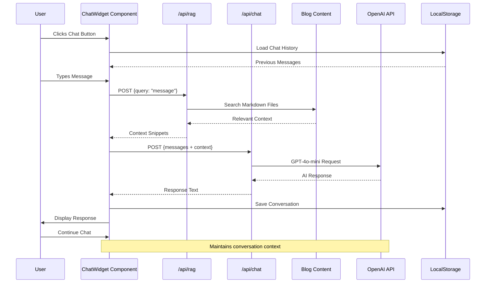

---

## Integration Architecture

### External API Integration Map

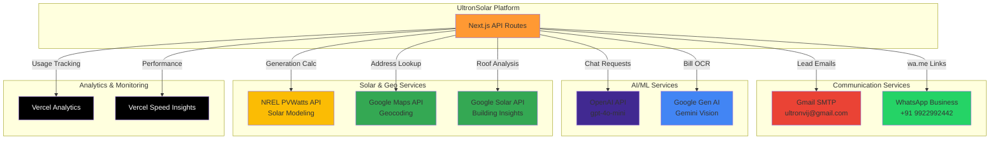

### Environment Variables & Security

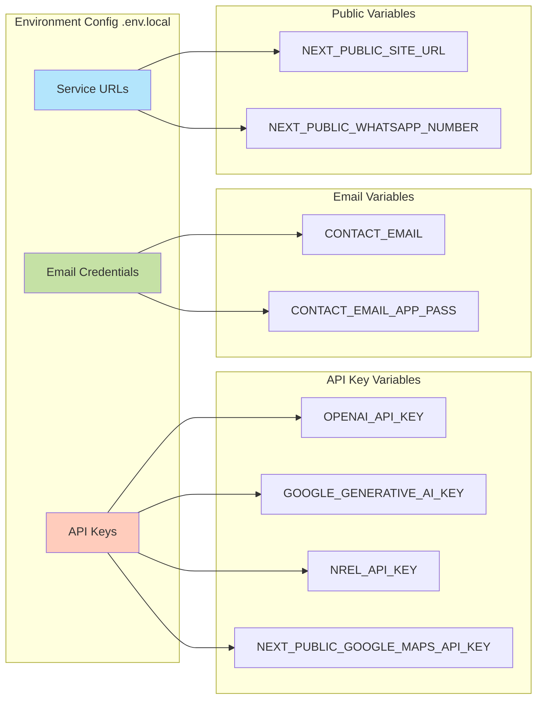

---

## Deployment Architecture

### Vercel Deployment Flow

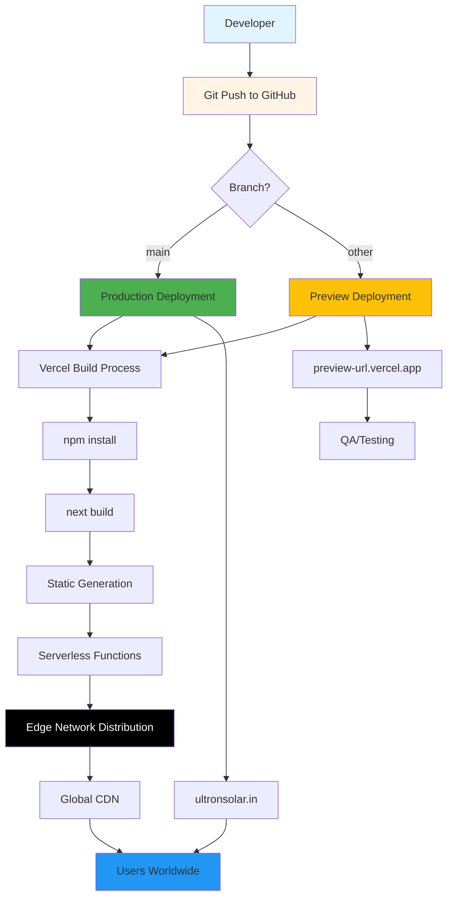

### Application Runtime Architecture

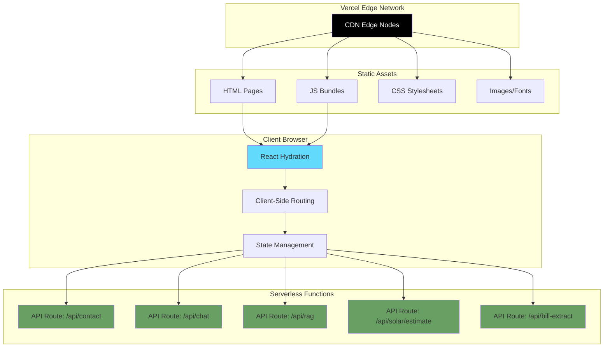

### Performance & Optimization Strategy

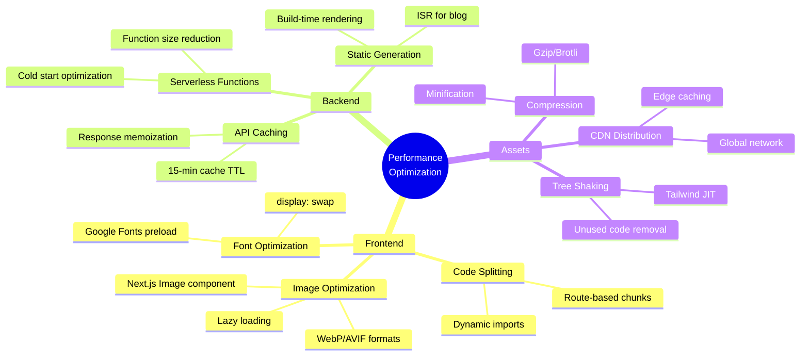

---

## State Management Architecture

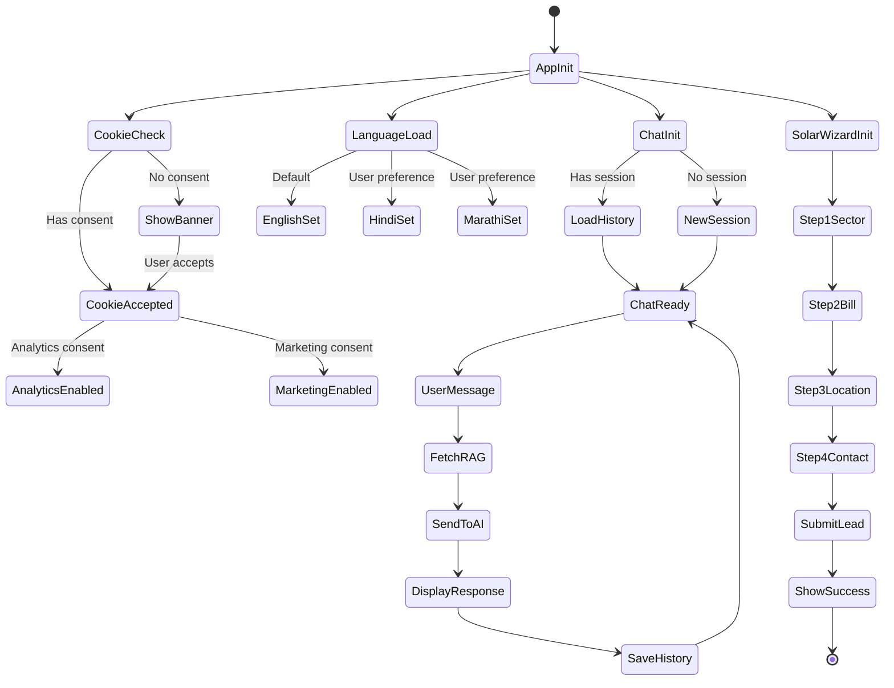

---

## Security Architecture

### Security Layers

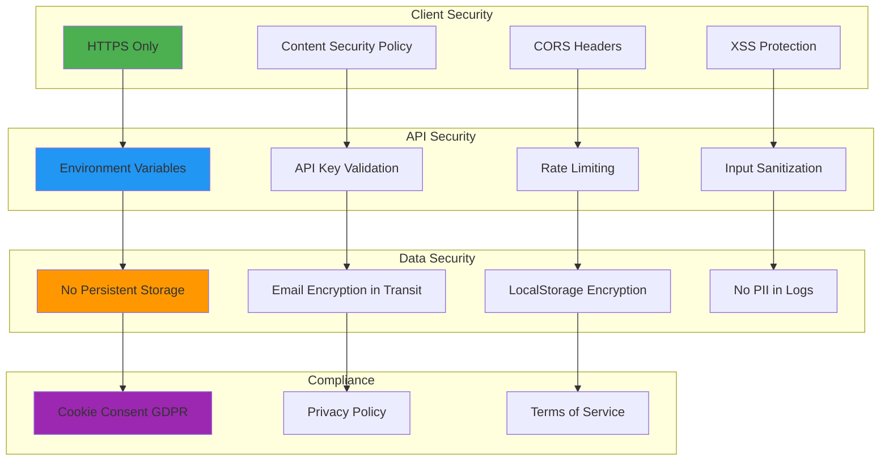

---

## Conclusion

The UltronSolar platform is built on a modern, scalable architecture leveraging Next.js 15's full-stack capabilities, AI-powered services, and serverless deployment. The system prioritizes:

- **Performance**: Edge CDN, static generation, code splitting
- **User Experience**: Smooth animations, multi-language support, mobile-first design
- **Lead Conversion**: Multiple touchpoints (wizard, chat, forms, WhatsApp)
- **Security**: Environment-based secrets, HTTPS, GDPR compliance
- **Scalability**: Serverless functions, global distribution, efficient caching

This architecture enables efficient customer acquisition while maintaining high performance and security standards.
