# UltronSolar - Technical Reference & API Documentation

## Table of Contents
- [Overview](#overview)
- [API Endpoints](#api-endpoints)
- [Component Architecture](#component-architecture)
- [Data Models & Types](#data-models--types)
- [Service Integrations](#service-integrations)
- [State Management](#state-management)
- [Performance & Optimization](#performance--optimization)
- [Development Workflow](#development-workflow)

---

## Overview

This document provides technical reference material for the UltronSolar platform, including API specifications, component details, data models, and integration patterns.

### Technology Matrix

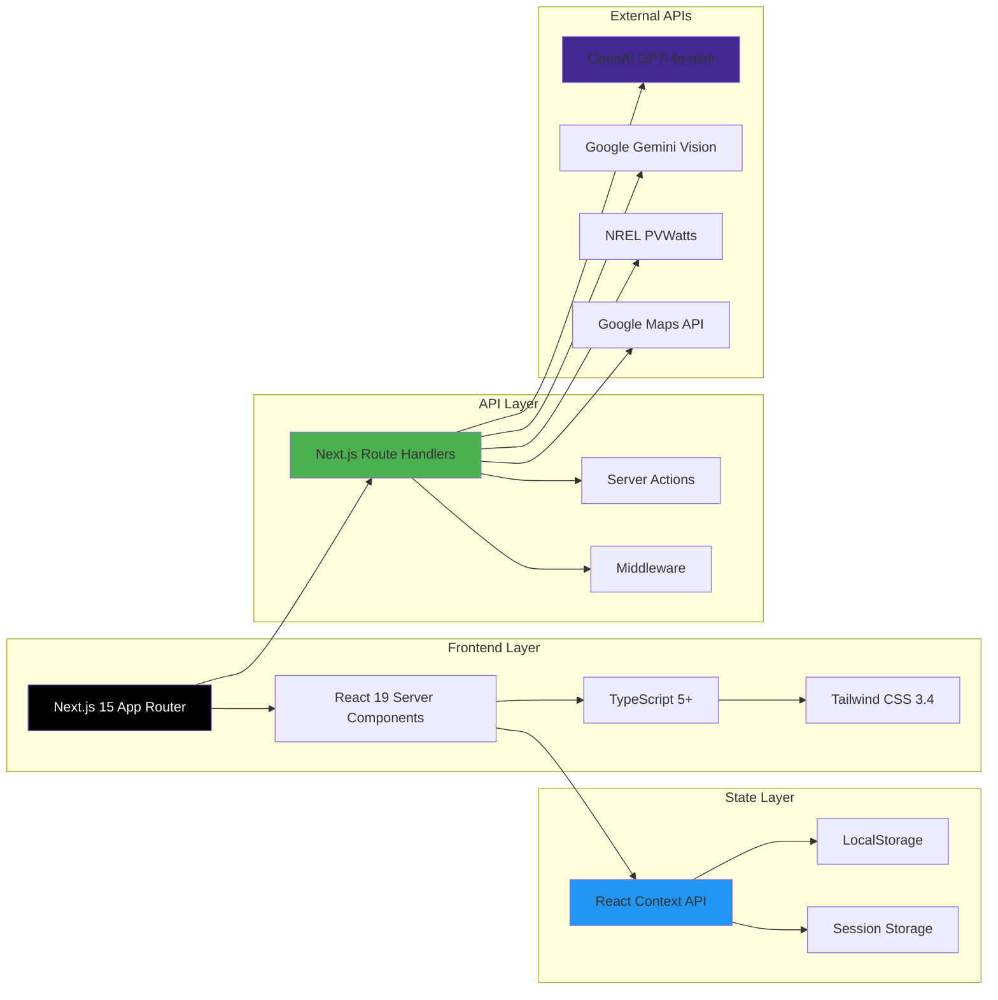
```mermaid
graph LR
    subgraph "Frontend Layer"
        A[Next.js 15 App Router]
        B[React 19 Server Components]
        C[TypeScript 5+]
        D[Tailwind CSS 3.4]
    end

    subgraph "State Layer"
        E[React Context API]
        F[LocalStorage]
        G[Session Storage]
    end

    subgraph "API Layer"
        H[Next.js Route Handlers]
        I[Server Actions]
        J[Middleware]
    end

    subgraph "External APIs"
        K[OpenAI GPT-4o-mini]
        L[Google Gemini Vision]
        M[NREL PVWatts]
        N[Google Maps API]
    end

    A --> B
    B --> C
    C --> D
    B --> E
    E --> F
    E --> G
    A --> H
    H --> I
    H --> J
    H --> K
    H --> L
    H --> M
    H --> N

    style A fill:#000000,color:#fff
    style E fill:#2196F3
    style H fill:#4CAF50
    style K fill:#412991
```

---

## API Endpoints

### API Routes Overview

```mermaid
graph TD
    subgraph "Public API Routes"
        A[/api/contact]
        B[/api/chat]
        C[/api/rag]
        D[/api/solar/estimate]
        E[/api/bill-extract]
        F[/api/building-insights]
        G[/api/geocode]
    end

    subgraph "HTTP Methods"
        A1[POST]
        A2[POST]
        A3[POST]
        A4[POST, GET]
        A5[POST]
        A6[POST]
        A7[POST]
    end

    subgraph "External Services"
        B1[Gmail SMTP]
        B2[OpenAI API]
        B3[File System]
        B4[NREL API]
        B5[Google Gen AI]
        B6[Google Maps]
        B7[Google Geocoding]
    end

    A --> A1
    B --> A2
    C --> A3
    D --> A4
    E --> A5
    F --> A6
    G --> A7

    A1 --> B1
    A2 --> B2
    A3 --> B3
    A4 --> B4
    A5 --> B5
    A6 --> B6
    A7 --> B7

    style A fill:#ff9933
    style B fill:#ff9933
    style C fill:#ff9933
    style D fill:#ff9933
    style E fill:#ff9933
```

### 1. Contact API (`/api/contact`)

**Endpoint**: `POST /api/contact`

**Purpose**: Lead submission and email delivery

**Request Body**:
```typescript
{
  name: string;           // Required, min 2 chars
  phone: string;          // Required, 10 digits
  email?: string;         // Optional, valid email format
  sector?: string;        // Optional: "residential" | "agricultural" | "commercial"
  bill?: string;          // Optional: monthly bill amount
  location?: string;      // Optional: city name
  message?: string;       // Optional: additional details
  requirement?: string;   // Optional: specific need
}
```

**Response**:
```typescript
{
  success: boolean;
  message: string;
  error?: string;
}
```

**Flow Diagram**:
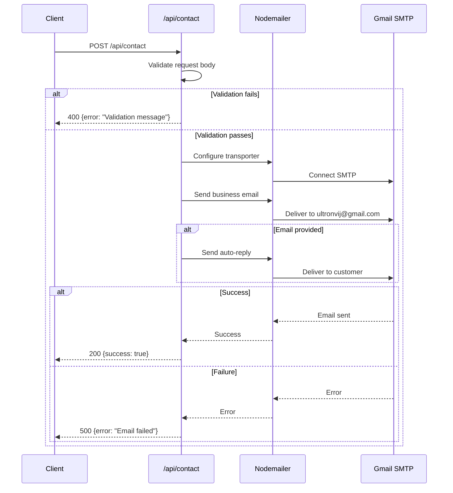
```mermaid
sequenceDiagram
    participant C as Client
    participant A as /api/contact
    participant N as Nodemailer
    participant G as Gmail SMTP

    C->>A: POST /api/contact
    A->>A: Validate request body

    alt Validation fails
        A-->>C: 400 {error: "Validation message"}
    else Validation passes
        A->>N: Configure transporter
        N->>G: Connect SMTP

        A->>N: Send business email
        N->>G: Deliver to ultronvij@gmail.com

        alt Email provided
            A->>N: Send auto-reply
            N->>G: Deliver to customer
        end

        alt Success
            G-->>N: Email sent
            N-->>A: Success
            A-->>C: 200 {success: true}
        else Failure
            G-->>N: Error
            N-->>A: Error
            A-->>C: 500 {error: "Email failed"}
        end
    end
```

---

### 2. Chat API (`/api/chat`)

**Endpoint**: `POST /api/chat`

**Purpose**: AI chatbot responses with RAG context

**Request Body**:
```typescript
{
  messages: Array<{
    role: "user" | "assistant" | "system";
    content: string;
  }>;
  context?: string[];  // Optional RAG context from /api/rag
}
```

**Response**:
```typescript
{
  message: string;     // AI response text
  error?: string;
}
```

**System Prompt Strategy**:
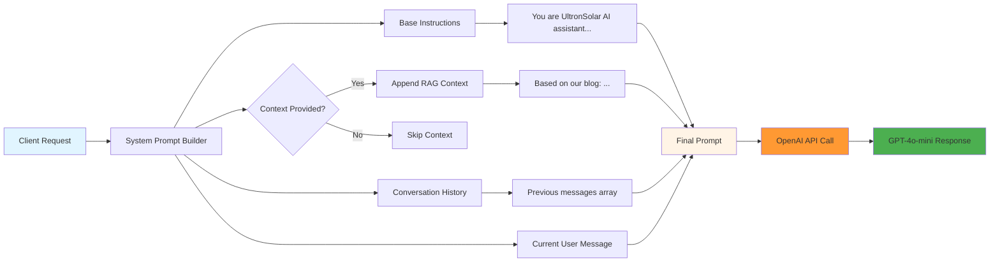
```mermaid
flowchart LR
    A[Client Request] --> B[System Prompt Builder]

    B --> C[Base Instructions]
    C --> D["You are UltronSolar AI assistant..."]

    B --> E{Context Provided?}
    E -->|Yes| F[Append RAG Context]
    E -->|No| G[Skip Context]

    F --> H["Based on our blog: ..."]

    B --> I[Conversation History]
    I --> J[Previous messages array]

    B --> K[Current User Message]

    D --> L[Final Prompt]
    H --> L
    J --> L
    K --> L

    L --> M[OpenAI API Call]
    M --> N[GPT-4o-mini Response]

    style A fill:#e1f5ff
    style L fill:#fff4e6
    style M fill:#ff9933
    style N fill:#4CAF50
```

---

### 3. RAG API (`/api/rag`)

**Endpoint**: `POST /api/rag`

**Purpose**: Retrieve relevant blog content for context

**Request Body**:
```typescript
{
  query: string;  // User's message/question
}
```

**Response**:
```typescript
{
  context: string[];  // Array of relevant content snippets
  sources?: Array<{
    title: string;
    slug: string;
    excerpt: string;
  }>;
}
```

**Context Retrieval Algorithm**:
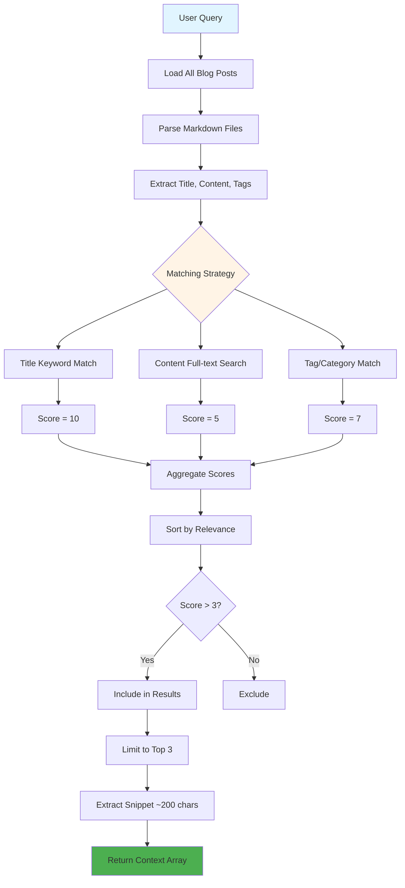
```mermaid
flowchart TD
    A[User Query] --> B[Load All Blog Posts]

    B --> C[Parse Markdown Files]
    C --> D[Extract Title, Content, Tags]

    D --> E{Matching Strategy}

    E --> F[Title Keyword Match]
    E --> G[Content Full-text Search]
    E --> H[Tag/Category Match]

    F --> I[Score = 10]
    G --> J[Score = 5]
    H --> K[Score = 7]

    I --> L[Aggregate Scores]
    J --> L
    K --> L

    L --> M[Sort by Relevance]
    M --> N{Score > 3?}

    N -->|Yes| O[Include in Results]
    N -->|No| P[Exclude]

    O --> Q[Limit to Top 3]
    Q --> R[Extract Snippet ~200 chars]

    R --> S[Return Context Array]

    style A fill:#e1f5ff
    style E fill:#fff4e6
    style S fill:#4CAF50
```

---

### 4. Solar Estimate API (`/api/solar/estimate`)

**Endpoint**: `POST /api/solar/estimate` or `GET /api/solar/estimate?bill=3000&lat=20.9&lon=74.7`

**Purpose**: Calculate solar system size and ROI

**Request Body (POST)**:
```typescript
{
  monthlyBill: number;    // Monthly electricity bill in ₹
  location: {
    lat: number;          // Latitude
    lon: number;          // Longitude
  };
  tariffRate?: number;    // Optional, default 7 ₹/kWh
  systemCost?: number;    // Optional, default 50000 ₹/kW
}
```

**Response**:
```typescript
{
  systemSize: number;           // kW
  annualGeneration: number;     // kWh/year
  annualSavings: number;        // ₹/year
  paybackPeriod: number;        // years
  co2Offset: number;            // tons/year
  treesEquivalent: number;      // number of trees
  peakSunHours: number;         // hours/day
  systemCost: number;           // ₹ total
}
```

**Calculation Logic**:
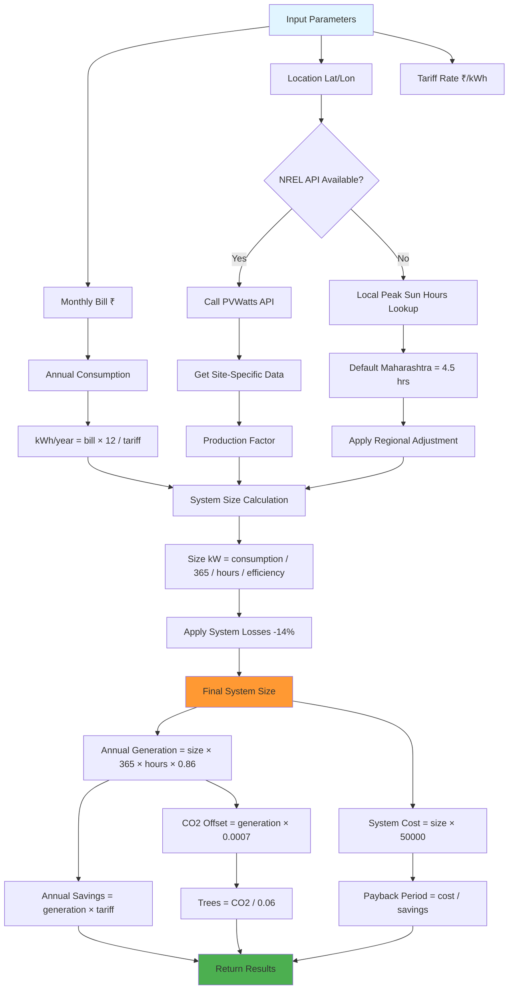
```mermaid
flowchart TD
    A[Input Parameters] --> B[Monthly Bill ₹]
    A --> C[Location Lat/Lon]
    A --> D[Tariff Rate ₹/kWh]

    B --> E[Annual Consumption]
    E --> F[kWh/year = bill × 12 / tariff]

    C --> G{NREL API Available?}
    G -->|Yes| H[Call PVWatts API]
    G -->|No| I[Local Peak Sun Hours Lookup]

    H --> J[Get Site-Specific Data]
    J --> K[Production Factor]

    I --> L[Default Maharashtra = 4.5 hrs]
    L --> M[Apply Regional Adjustment]

    K --> N[System Size Calculation]
    M --> N
    F --> N

    N --> O[Size kW = consumption / 365 / hours / efficiency]
    O --> P[Apply System Losses -14%]

    P --> Q[Final System Size]

    Q --> R[Annual Generation = size × 365 × hours × 0.86]
    Q --> S[System Cost = size × 50000]

    R --> T[Annual Savings = generation × tariff]
    S --> U[Payback Period = cost / savings]

    R --> V[CO2 Offset = generation × 0.0007]
    V --> W[Trees = CO2 / 0.06]

    T --> X[Return Results]
    U --> X
    W --> X

    style A fill:#e1f5ff
    style Q fill:#ff9933
    style X fill:#4CAF50
```

**Peak Sun Hours by Region**:
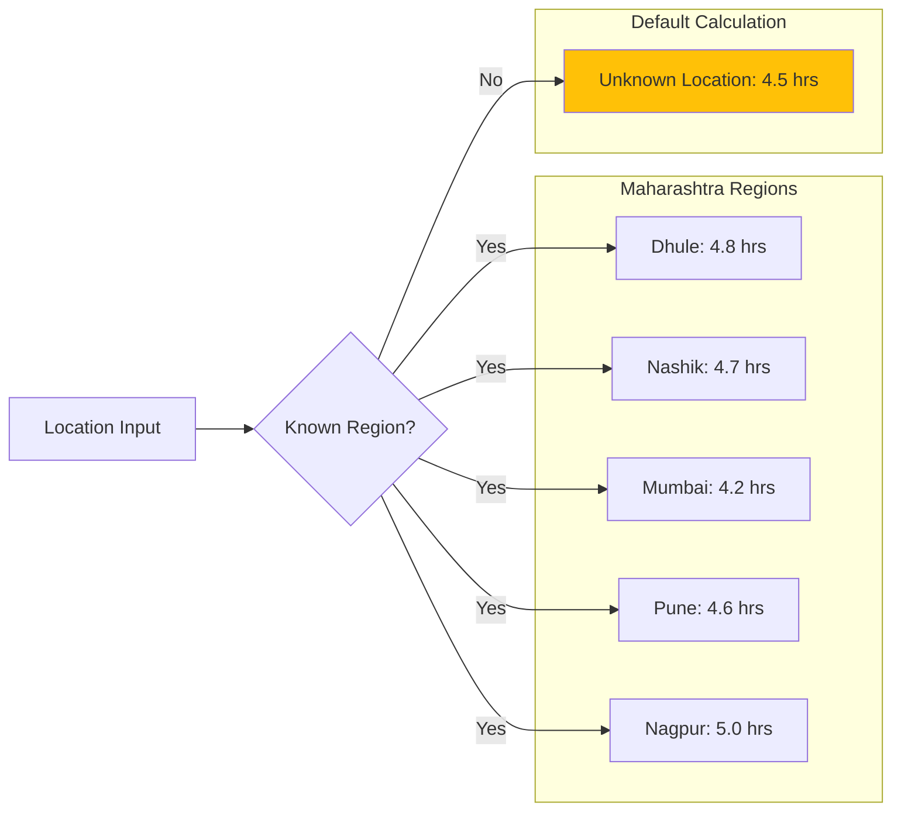
```mermaid
graph LR
    subgraph "Maharashtra Regions"
        A[Dhule: 4.8 hrs]
        B[Nashik: 4.7 hrs]
        C[Mumbai: 4.2 hrs]
        D[Pune: 4.6 hrs]
        E[Nagpur: 5.0 hrs]
    end

    subgraph "Default Calculation"
        F[Unknown Location: 4.5 hrs]
    end

    G[Location Input] --> H{Known Region?}
    H -->|Yes| A
    H -->|Yes| B
    H -->|Yes| C
    H -->|Yes| D
    H -->|Yes| E
    H -->|No| F

    style F fill:#FFC107
```

---

### 5. Bill Extract API (`/api/bill-extract`)

**Endpoint**: `POST /api/bill-extract`

**Purpose**: Extract consumption data from electricity bill images

**Request Body**:
```typescript
FormData {
  file: File;  // Image file (JPEG, PNG, PDF)
}
```

**Response**:
```typescript
{
  consumption: number;      // Monthly kWh
  tariffRate?: number;      // ₹/kWh
  provider?: string;        // Utility company name
  success: boolean;
  error?: string;
}
```

**Vision AI Extraction Flow**:
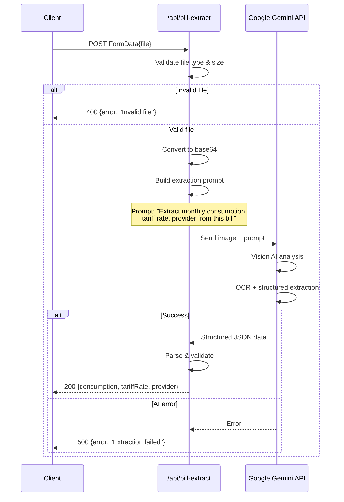
```mermaid
sequenceDiagram
    participant C as Client
    participant A as /api/bill-extract
    participant G as Google Gemini API

    C->>A: POST FormData{file}
    A->>A: Validate file type & size

    alt Invalid file
        A-->>C: 400 {error: "Invalid file"}
    else Valid file
        A->>A: Convert to base64
        A->>A: Build extraction prompt

        Note over A: Prompt: "Extract monthly consumption,<br/>tariff rate, provider from this bill"

        A->>G: Send image + prompt
        G->>G: Vision AI analysis
        G->>G: OCR + structured extraction

        alt Success
            G-->>A: Structured JSON data
            A->>A: Parse & validate
            A-->>C: 200 {consumption, tariffRate, provider}
        else AI error
            G-->>A: Error
            A-->>C: 500 {error: "Extraction failed"}
        end
    end
```

---

### 6. Building Insights API (`/api/building-insights`)

**Endpoint**: `POST /api/building-insights`

**Purpose**: Get roof solar potential from Google Solar API

**Request Body**:
```typescript
{
  location: {
    latitude: number;
    longitude: number;
  };
}
```

**Response**:
```typescript
{
  roofArea: number;              // m²
  sunlightHours: number;         // peak hours/year
  solarPotential: number;        // kWh/year potential
  panelCapacity: number;         // Max kW installable
  carbonOffset: number;          // tons CO2/year
  imageryDate: string;           // Satellite image date
}
```

---

### 7. Geocode API (`/api/geocode`)

**Endpoint**: `POST /api/geocode`

**Purpose**: Convert address to coordinates

**Request Body**:
```typescript
{
  address: string;  // Full address or city name
}
```

**Response**:
```typescript
{
  lat: number;
  lon: number;
  formattedAddress: string;
  placeId: string;
}
```

---

## Component Architecture

### Component Hierarchy Map

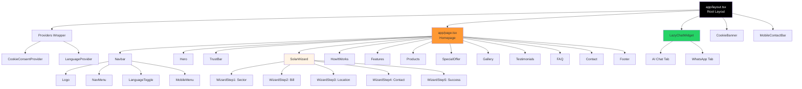
```mermaid
graph TD
    A[app/layout.tsx<br/>Root Layout] --> B[Providers Wrapper]

    B --> C1[CookieConsentProvider]
    B --> C2[LanguageProvider]

    A --> D[app/page.tsx<br/>Homepage]

    D --> E1[Navbar]
    D --> E2[Hero]
    D --> E3[TrustBar]
    D --> E4[SolarWizard]
    D --> E5[HowItWorks]
    D --> E6[Features]
    D --> E7[Products]
    D --> E8[SpecialOffer]
    D --> E9[Gallery]
    D --> E10[Testimonials]
    D --> E11[FAQ]
    D --> E12[Contact]
    D --> E13[Footer]

    A --> F[LazyChatWidget]
    A --> G[CookieBanner]
    A --> H[MobileContactBar]

    E1 --> E1A[Logo]
    E1 --> E1B[NavMenu]
    E1 --> E1C[LanguageToggle]
    E1 --> E1D[MobileMenu]

    E4 --> E4A[WizardStep1: Sector]
    E4 --> E4B[WizardStep2: Bill]
    E4 --> E4C[WizardStep3: Location]
    E4 --> E4D[WizardStep4: Contact]
    E4 --> E4E[WizardStep5: Success]

    F --> F1[AI Chat Tab]
    F --> F2[WhatsApp Tab]

    style A fill:#000000,color:#fff
    style D fill:#ff9933
    style E4 fill:#fff4e6
    style F fill:#25D366
```

### Key Components Detail

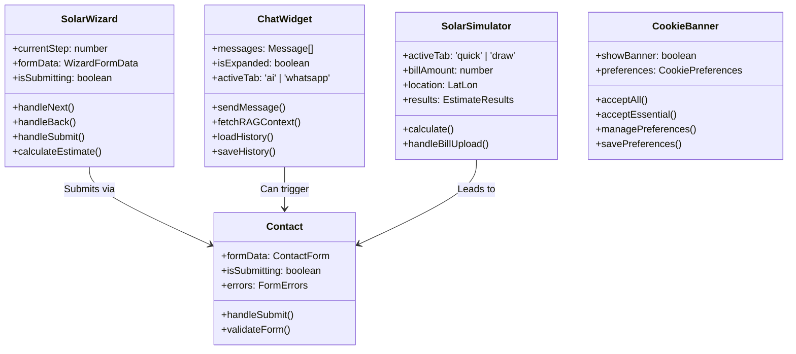
```mermaid
classDiagram
    class SolarWizard {
        +currentStep: number
        +formData: WizardFormData
        +isSubmitting: boolean
        +handleNext()
        +handleBack()
        +handleSubmit()
        +calculateEstimate()
    }

    class ChatWidget {
        +messages: Message[]
        +isExpanded: boolean
        +activeTab: 'ai' | 'whatsapp'
        +sendMessage()
        +fetchRAGContext()
        +loadHistory()
        +saveHistory()
    }

    class SolarSimulator {
        +activeTab: 'quick' | 'draw'
        +billAmount: number
        +location: LatLon
        +results: EstimateResults
        +calculate()
        +handleBillUpload()
    }

    class CookieBanner {
        +showBanner: boolean
        +preferences: CookiePreferences
        +acceptAll()
        +acceptEssential()
        +managePreferences()
        +savePreferences()
    }

    class Contact {
        +formData: ContactForm
        +isSubmitting: boolean
        +errors: FormErrors
        +handleSubmit()
        +validateForm()
    }

    SolarWizard --> Contact: Submits via
    ChatWidget --> Contact: Can trigger
    SolarSimulator --> Contact: Leads to
```

### Component Communication Patterns

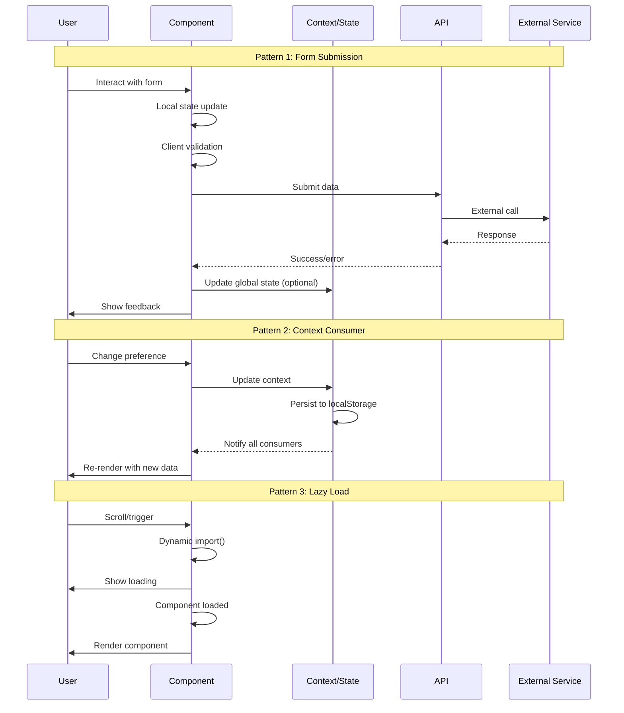
```mermaid
sequenceDiagram
    participant U as User
    participant C as Component
    participant S as Context/State
    participant A as API
    participant E as External Service

    Note over U,E: Pattern 1: Form Submission
    U->>C: Interact with form
    C->>C: Local state update
    C->>C: Client validation
    C->>A: Submit data
    A->>E: External call
    E-->>A: Response
    A-->>C: Success/error
    C->>S: Update global state (optional)
    C->>U: Show feedback

    Note over U,E: Pattern 2: Context Consumer
    U->>C: Change preference
    C->>S: Update context
    S->>S: Persist to localStorage
    S-->>C: Notify all consumers
    C->>U: Re-render with new data

    Note over U,E: Pattern 3: Lazy Load
    U->>C: Scroll/trigger
    C->>C: Dynamic import()
    C->>U: Show loading
    C->>C: Component loaded
    C->>U: Render component
```

---

## Data Models & Types

### Core Type Definitions

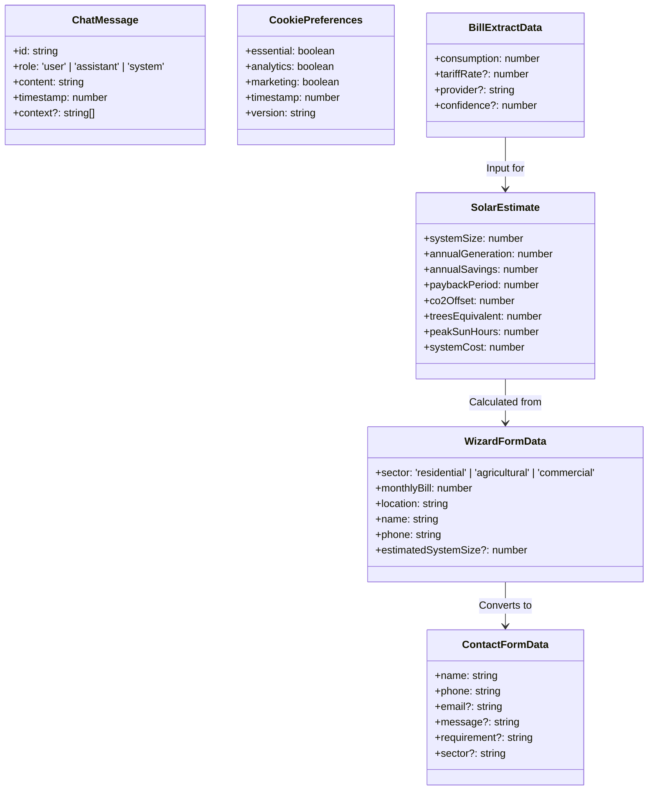
```mermaid
classDiagram
    class SolarEstimate {
        +systemSize: number
        +annualGeneration: number
        +annualSavings: number
        +paybackPeriod: number
        +co2Offset: number
        +treesEquivalent: number
        +peakSunHours: number
        +systemCost: number
    }

    class WizardFormData {
        +sector: 'residential' | 'agricultural' | 'commercial'
        +monthlyBill: number
        +location: string
        +name: string
        +phone: string
        +estimatedSystemSize?: number
    }

    class ChatMessage {
        +id: string
        +role: 'user' | 'assistant' | 'system'
        +content: string
        +timestamp: number
        +context?: string[]
    }

    class CookiePreferences {
        +essential: boolean
        +analytics: boolean
        +marketing: boolean
        +timestamp: number
        +version: string
    }

    class BillExtractData {
        +consumption: number
        +tariffRate?: number
        +provider?: string
        +confidence?: number
    }

    class ContactFormData {
        +name: string
        +phone: string
        +email?: string
        +message?: string
        +requirement?: string
        +sector?: string
    }

    WizardFormData --> ContactFormData: Converts to
    SolarEstimate --> WizardFormData: Calculated from
    BillExtractData --> SolarEstimate: Input for
```

### Type Dependencies Graph

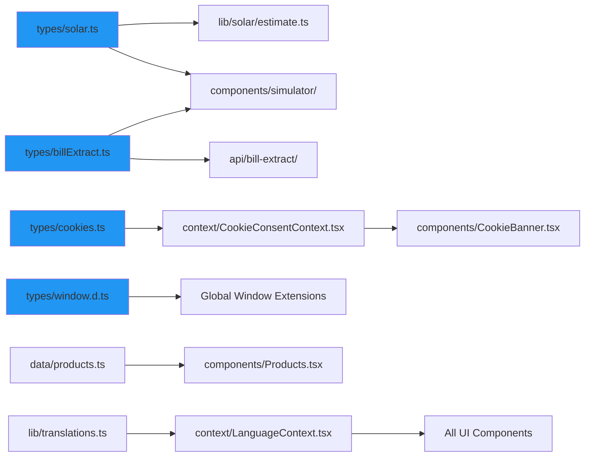
```mermaid
graph LR
    A[types/solar.ts] --> B[lib/solar/estimate.ts]
    A --> C[components/simulator/]

    D[types/billExtract.ts] --> E[api/bill-extract/]
    D --> C

    F[types/cookies.ts] --> G[context/CookieConsentContext.tsx]
    G --> H[components/CookieBanner.tsx]

    I[types/window.d.ts] --> J[Global Window Extensions]

    K[data/products.ts] --> L[components/Products.tsx]

    M[lib/translations.ts] --> N[context/LanguageContext.tsx]
    N --> O[All UI Components]

    style A fill:#2196F3
    style D fill:#2196F3
    style F fill:#2196F3
    style I fill:#2196F3
```

---

## Service Integrations

### External Service Dependencies


```mermaid
graph TD
    subgraph "UltronSolar Platform"
        A[Next.js Application]
    end

    subgraph "AI/ML Services"
        B1[OpenAI API]
        B2[Google Generative AI]
    end

    subgraph "Solar Data Services"
        C1[NREL PVWatts API]
        C2[Google Solar API]
    end

    subgraph "Mapping Services"
        D1[Google Maps JavaScript API]
        D2[Google Geocoding API]
    end

    subgraph "Communication Services"
        E1[Gmail SMTP Server]
        E2[WhatsApp Business API]
    end

    subgraph "Analytics Services"
        F1[Vercel Analytics]
        F2[Vercel Speed Insights]
        F3[Google Analytics Optional]
        F4[Facebook Pixel Optional]
    end

    A -->|Chat requests| B1
    A -->|Bill OCR| B2
    A -->|Solar calculations| C1
    A -->|Roof insights| C2
    A -->|Map rendering| D1
    A -->|Address lookup| D2
    A -->|Email delivery| E1
    A -->|wa.me links| E2
    A -->|Usage tracking| F1
    A -->|Performance| F2
    A -->|User analytics| F3
    A -->|Remarketing| F4

    style A fill:#ff9933
    style B1 fill:#412991
    style B2 fill:#4285F4
    style C1 fill:#FBBC04
    style E1 fill:#EA4335
    style E2 fill:#25D366
```

### Service Health & Fallback Strategy

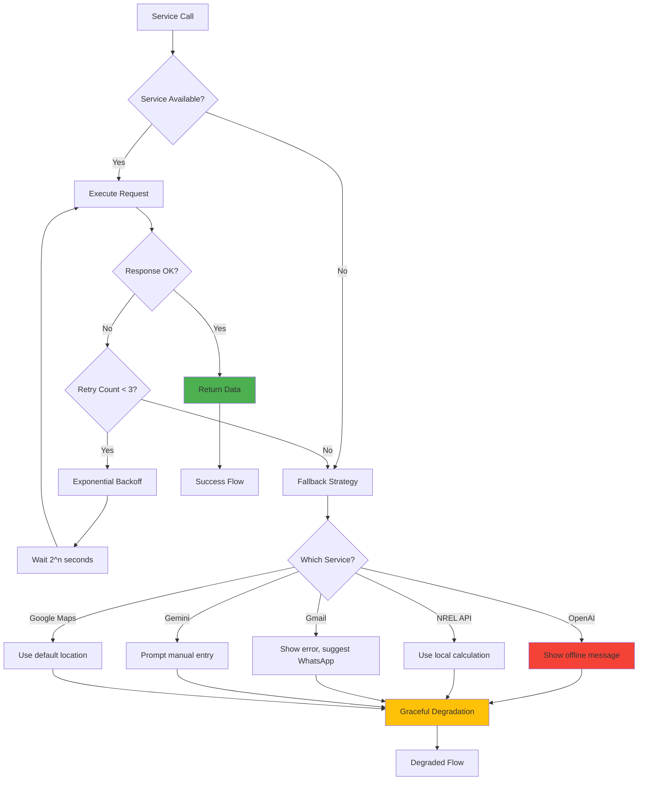
```mermaid
flowchart TD
    A[Service Call] --> B{Service Available?}

    B -->|Yes| C[Execute Request]
    B -->|No| D[Fallback Strategy]

    C --> E{Response OK?}
    E -->|Yes| F[Return Data]
    E -->|No| G{Retry Count < 3?}

    G -->|Yes| H[Exponential Backoff]
    G -->|No| D

    H --> I[Wait 2^n seconds]
    I --> C

    D --> J{Which Service?}

    J -->|OpenAI| K[Show offline message]
    J -->|NREL API| L[Use local calculation]
    J -->|Gmail| M[Show error, suggest WhatsApp]
    J -->|Gemini| N[Prompt manual entry]
    J -->|Google Maps| O[Use default location]

    K --> P[Graceful Degradation]
    L --> P
    M --> P
    N --> P
    O --> P

    F --> Q[Success Flow]
    P --> R[Degraded Flow]

    style F fill:#4CAF50
    style P fill:#FFC107
    style K fill:#F44336
```

---

## State Management

### Global State Architecture

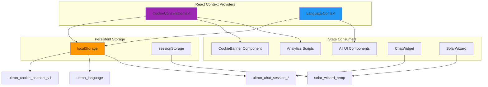
```mermaid
graph TD
    subgraph "React Context Providers"
        A[CookieConsentContext]
        B[LanguageContext]
    end

    subgraph "Persistent Storage"
        C[localStorage]
        D[sessionStorage]
    end

    subgraph "State Consumers"
        E1[CookieBanner Component]
        E2[All UI Components]
        E3[Analytics Scripts]
        E4[ChatWidget]
        E5[SolarWizard]
    end

    A --> C
    A --> E1
    A --> E3

    B --> C
    B --> E2

    C --> F[ultron_cookie_consent_v1]
    C --> G[ultron_language]
    C --> H[ultron_chat_session_*]

    D --> I[solar_wizard_temp]

    E4 --> H
    E5 --> I

    style A fill:#9C27B0
    style B fill:#2196F3
    style C fill:#FF9800
```

### State Persistence Strategy

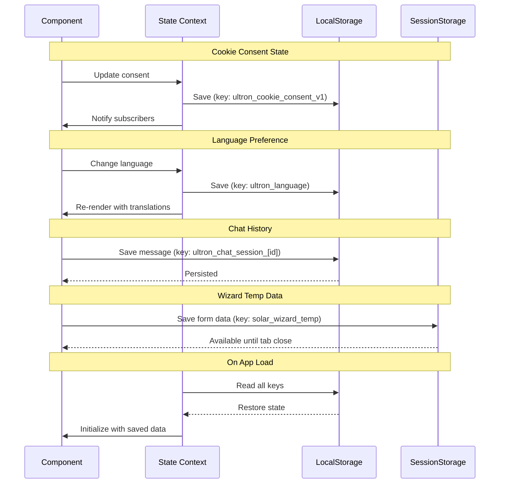
```mermaid
sequenceDiagram
    participant C as Component
    participant S as State Context
    participant L as LocalStorage
    participant SE as SessionStorage

    Note over C,SE: Cookie Consent State
    C->>S: Update consent
    S->>L: Save (key: ultron_cookie_consent_v1)
    S->>C: Notify subscribers

    Note over C,SE: Language Preference
    C->>S: Change language
    S->>L: Save (key: ultron_language)
    S->>C: Re-render with translations

    Note over C,SE: Chat History
    C->>L: Save message (key: ultron_chat_session_[id])
    L-->>C: Persisted

    Note over C,SE: Wizard Temp Data
    C->>SE: Save form data (key: solar_wizard_temp)
    SE-->>C: Available until tab close

    Note over C,SE: On App Load
    S->>L: Read all keys
    L-->>S: Restore state
    S->>C: Initialize with saved data
```

---

## Performance & Optimization

### Build Optimization Strategy

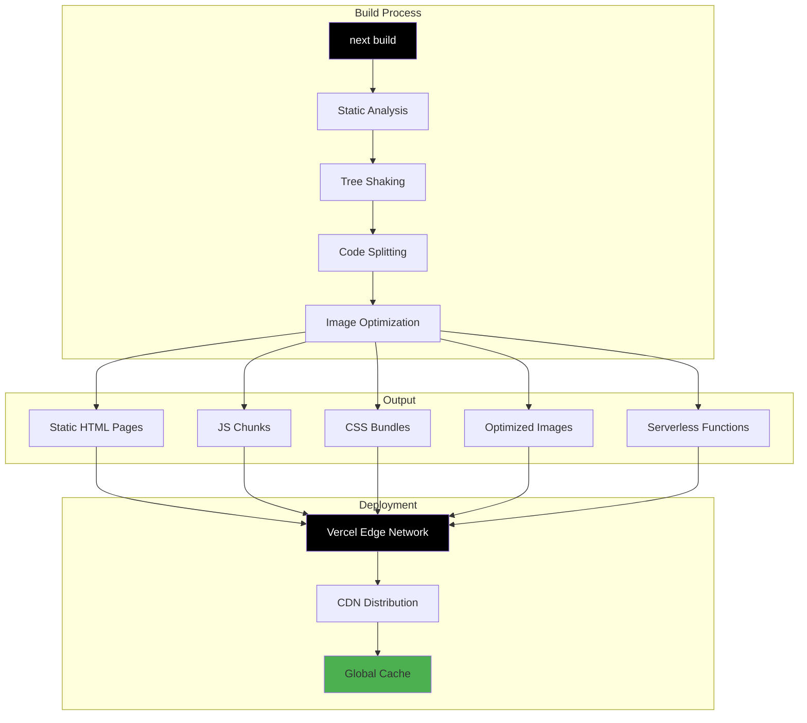
```mermaid
graph TB
    subgraph "Build Process"
        A[next build]
        B[Static Analysis]
        C[Tree Shaking]
        D[Code Splitting]
        E[Image Optimization]
    end

    subgraph "Output"
        F[Static HTML Pages]
        G[JS Chunks]
        H[CSS Bundles]
        I[Optimized Images]
        J[Serverless Functions]
    end

    subgraph "Deployment"
        K[Vercel Edge Network]
        L[CDN Distribution]
        M[Global Cache]
    end

    A --> B
    B --> C
    C --> D
    D --> E

    E --> F
    E --> G
    E --> H
    E --> I
    E --> J

    F --> K
    G --> K
    H --> K
    I --> K
    J --> K

    K --> L
    L --> M

    style A fill:#000000,color:#fff
    style K fill:#000000,color:#fff
    style M fill:#4CAF50
```

### Performance Metrics

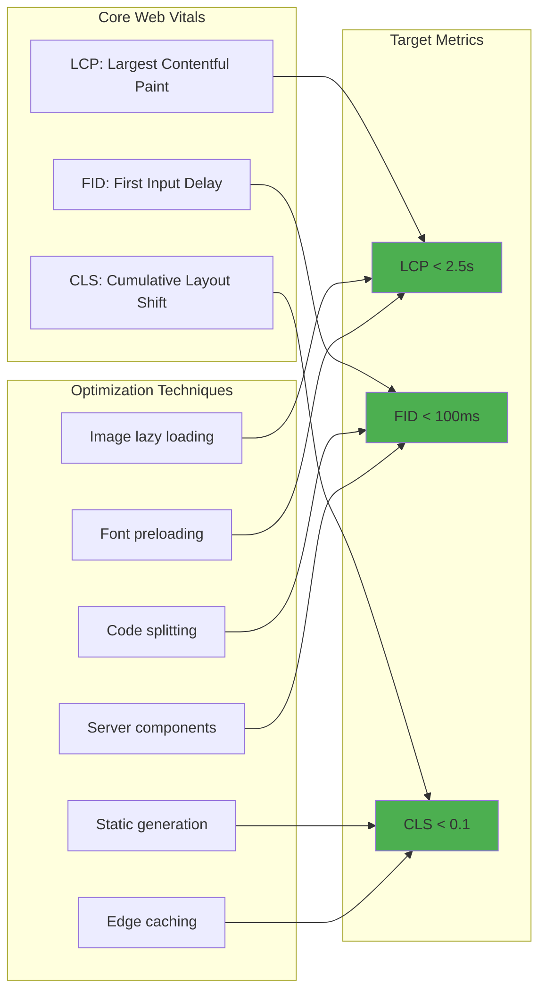
```mermaid
graph LR
    subgraph "Core Web Vitals"
        A[LCP: Largest Contentful Paint]
        B[FID: First Input Delay]
        C[CLS: Cumulative Layout Shift]
    end

    subgraph "Target Metrics"
        D[LCP < 2.5s]
        E[FID < 100ms]
        F[CLS < 0.1]
    end

    subgraph "Optimization Techniques"
        G[Image lazy loading]
        H[Font preloading]
        I[Code splitting]
        J[Server components]
        K[Static generation]
        L[Edge caching]
    end

    A --> D
    B --> E
    C --> F

    G --> D
    H --> D
    I --> E
    J --> E
    K --> F
    L --> F

    style D fill:#4CAF50
    style E fill:#4CAF50
    style F fill:#4CAF50
```

### Caching Strategy

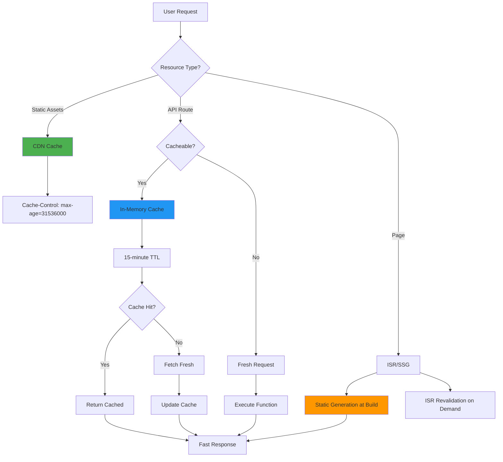
```mermaid
flowchart TD
    A[User Request] --> B{Resource Type?}

    B -->|Static Assets| C[CDN Cache]
    B -->|API Route| D{Cacheable?}
    B -->|Page| E[ISR/SSG]

    C --> F[Cache-Control: max-age=31536000]

    D -->|Yes| G[In-Memory Cache]
    D -->|No| H[Fresh Request]

    G --> I[15-minute TTL]
    I --> J{Cache Hit?}

    J -->|Yes| K[Return Cached]
    J -->|No| L[Fetch Fresh]
    L --> M[Update Cache]

    E --> N[Static Generation at Build]
    E --> O[ISR Revalidation on Demand]

    H --> P[Execute Function]

    K --> Q[Fast Response]
    M --> Q
    N --> Q
    P --> Q

    style C fill:#4CAF50
    style G fill:#2196F3
    style N fill:#FF9800
```

---

## Development Workflow

### Git Workflow

```mermaid
gitGraph
    commit id: "Initial commit"
    branch develop
    checkout develop
    commit id: "Feature: Solar Wizard"
    commit id: "Feature: Chat Widget"
    branch feature/cookie-consent
    checkout feature/cookie-consent
    commit id: "Add cookie banner"
    commit id: "Add preference modal"
    checkout develop
    merge feature/cookie-consent
    commit id: "Feature: Bill extraction"
    checkout main
    merge develop tag: "v1.0.0"
    checkout develop
    commit id: "Feature: Multi-language"
    commit id: "Fix: Mobile UI"
    checkout main
    merge develop tag: "v1.1.0"
```

### CI/CD Pipeline

```mermaid
flowchart LR
    A[Git Push] --> B[GitHub Repository]

    B --> C{Branch?}

    C -->|main| D[Vercel Production Build]
    C -->|develop| E[Vercel Preview Build]
    C -->|feature/*| E

    D --> F[Run Tests]
    E --> F

    F --> G{Tests Pass?}

    G -->|Yes| H[Build Next.js App]
    G -->|No| I[Notify Developer]

    H --> J[Deploy to Edge Network]

    J --> K{Branch?}
    K -->|main| L[ultronsolar.in]
    K -->|other| M[preview-*.vercel.app]

    L --> N[Production Live]
    M --> O[Preview URL]

    I --> P[Fix Issues]
    P --> A

    style D fill:#4CAF50
    style E fill:#FFC107
    style N fill:#4CAF50
```

### Environment Configuration

```mermaid
graph TB
    subgraph "Local Development"
        A[.env.local]
        B[localhost:3000]
    end

    subgraph "Preview/Staging"
        C[Vercel Environment Variables]
        D[preview-*.vercel.app]
    end

    subgraph "Production"
        E[Vercel Production Secrets]
        F[ultronsolar.in]
    end

    A --> G[Environment Variables]
    C --> G
    E --> G

    G --> H[OPENAI_API_KEY]
    G --> I[GOOGLE_GENERATIVE_AI_KEY]
    G --> J[NREL_API_KEY]
    G --> K[NEXT_PUBLIC_GOOGLE_MAPS_API_KEY]
    G --> L[CONTACT_EMAIL]
    G --> M[CONTACT_EMAIL_APP_PASS]

    H --> B
    H --> D
    H --> F

    style A fill:#FFC107
    style C fill:#2196F3
    style E fill:#4CAF50
```

---

## API Rate Limits & Quotas

```mermaid
graph LR
    subgraph "Service Quotas"
        A[OpenAI: 60 RPM]
        B[Google Gemini: 60 RPM]
        C[NREL PVWatts: 1000/day]
        D[Google Maps: 25000/day]
        E[Gmail SMTP: 500/day]
    end

    subgraph "Rate Limit Handling"
        F[Client-side Throttling]
        G[Server-side Queue]
        H[Exponential Backoff]
        I[Fallback Mechanisms]
    end

    A --> F
    B --> F
    C --> G
    D --> F
    E --> H

    F --> J[Prevent Spam]
    G --> K[Batch Requests]
    H --> L[Retry Logic]
    I --> M[Graceful Degradation]

    style A fill:#F44336
    style B fill:#F44336
    style C fill:#FF9800
    style D fill:#FF9800
    style E fill:#FF9800
```

---

## Error Tracking & Monitoring

```mermaid
flowchart TD
    A[Application Error] --> B{Error Type}

    B -->|Client Error| C[Console.error]
    B -->|API Error| D[HTTP Status Code]
    B -->|Server Error| E[Next.js Error]

    C --> F[User-Friendly Message]
    D --> F
    E --> F

    F --> G[Log to Console Dev]

    G --> H{Production?}

    H -->|Yes| I[Vercel Logs]
    H -->|No| J[Terminal Output]

    I --> K[Error Dashboard]

    B --> L[Vercel Speed Insights]
    L --> M[Performance Monitoring]

    B --> N[Vercel Analytics]
    N --> O[User Behavior Tracking]

    style E fill:#F44336
    style I fill:#000000,color:#fff
    style M fill:#4CAF50
```

---

## Security Best Practices

```mermaid
mindmap
  root((Security))
    API Keys
      Environment variables only
      Never commit to Git
      Rotate regularly
      Separate dev/prod keys
    Input Validation
      Client-side validation
      Server-side sanitization
      Type checking TypeScript
      SQL injection prevention
    Authentication
      No user accounts needed
      API key validation
      Rate limiting per IP
    Data Privacy
      No PII in logs
      GDPR cookie consent
      Email encryption TLS
      LocalStorage encryption
    HTTPS
      Vercel enforces SSL
      Secure cookie flags
      HSTS headers
    Dependencies
      Regular npm audit
      Update packages
      Check vulnerabilities
```

---

## Conclusion

This technical reference provides comprehensive documentation for:

- **API Specifications**: All endpoints with request/response schemas
- **Component Architecture**: React component hierarchy and communication
- **Data Models**: TypeScript type definitions and relationships
- **Service Integrations**: External API dependencies and fallbacks
- **State Management**: Context providers and persistence strategies
- **Performance**: Optimization techniques and caching strategies
- **Development Workflow**: Git, CI/CD, and environment configuration

**For Developers**:
- Use this reference when integrating new features
- Follow established patterns for consistency
- Maintain type safety across all components
- Implement proper error handling and fallbacks
- Test all API integrations thoroughly

**For Maintainers**:
- Keep this documentation updated with code changes
- Document new APIs and components
- Update diagrams when architecture changes
- Maintain security best practices
