# UltronSolar - User Flows & Journey Documentation

## Table of Contents
- [Overview](#overview)
- [Customer Journey Map](#customer-journey-map)
- [Lead Generation Flows](#lead-generation-flows)
- [Solar Wizard Flow](#solar-wizard-flow)
- [Solar Calculator Flow](#solar-calculator-flow)
- [AI Chatbot Flow](#ai-chatbot-flow)
- [Contact & Communication Flows](#contact--communication-flows)
- [Cookie Consent Flow](#cookie-consent-flow)
- [Multi-Language Flow](#multi-language-flow)

---

## Overview

This document maps all user interaction flows within the UltronSolar platform, from first visit to lead conversion. Each flow includes sequence diagrams, state machines, and decision trees to illustrate the user experience.

---

## Customer Journey Map

### Complete Customer Journey

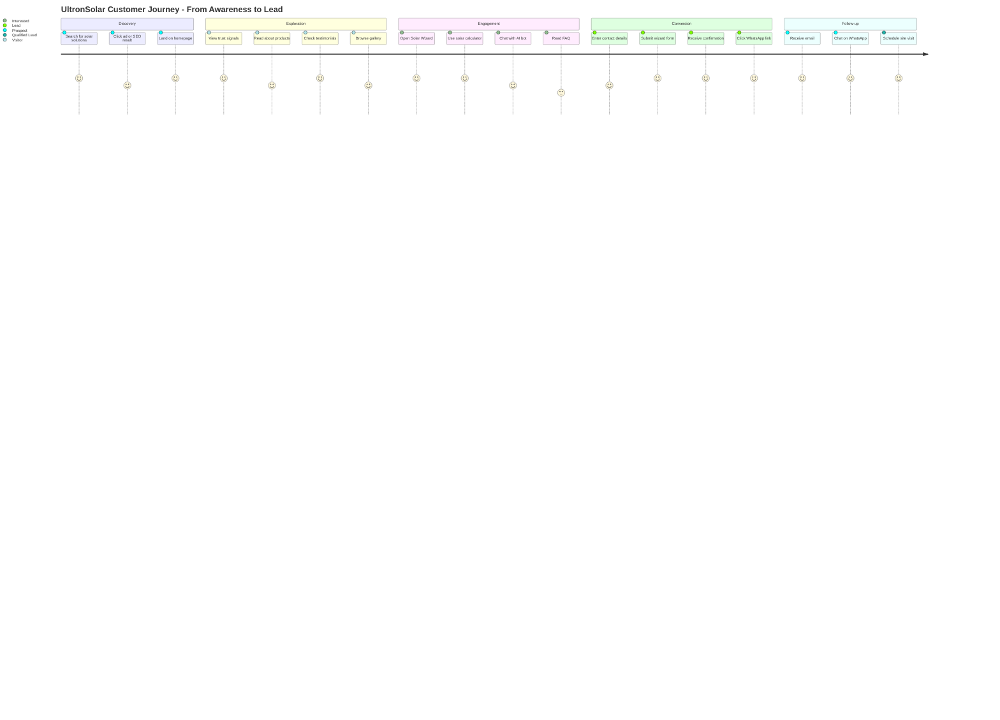
```mermaid
journey
    title UltronSolar Customer Journey - From Awareness to Lead
    section Discovery
      Search for solar solutions: 5: Prospect
      Click ad or SEO result: 4: Prospect
      Land on homepage: 5: Prospect
    section Exploration
      View trust signals: 5: Visitor
      Read about products: 4: Visitor
      Check testimonials: 5: Visitor
      Browse gallery: 4: Visitor
    section Engagement
      Open Solar Wizard: 5: Interested
      Use solar calculator: 5: Interested
      Chat with AI bot: 4: Interested
      Read FAQ: 3: Interested
    section Conversion
      Enter contact details: 4: Lead
      Submit wizard form: 5: Lead
      Receive confirmation: 5: Lead
      Click WhatsApp link: 5: Lead
    section Follow-up
      Receive email: 5: Prospect
      Chat on WhatsApp: 5: Prospect
      Schedule site visit: 5: Qualified Lead
```

### User Persona Flows

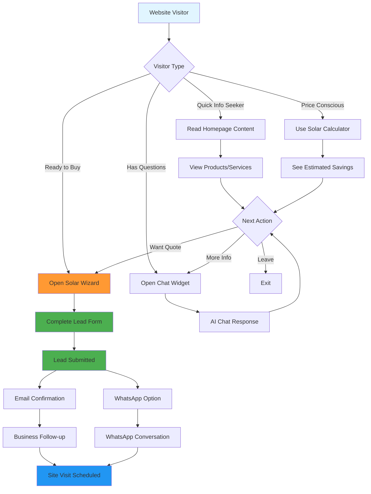
```mermaid
graph TD
    A[Website Visitor] --> B{Visitor Type}

    B -->|Quick Info Seeker| C[Read Homepage Content]
    B -->|Price Conscious| D[Use Solar Calculator]
    B -->|Ready to Buy| E[Open Solar Wizard]
    B -->|Has Questions| F[Open Chat Widget]

    C --> G[View Products/Services]
    D --> H[See Estimated Savings]
    E --> I[Complete Lead Form]
    F --> J[AI Chat Response]

    G --> K{Next Action}
    H --> K
    J --> K

    K -->|Want Quote| E
    K -->|More Info| F
    K -->|Leave| L[Exit]

    I --> M[Lead Submitted]
    M --> N[Email Confirmation]
    M --> O[WhatsApp Option]

    N --> P[Business Follow-up]
    O --> Q[WhatsApp Conversation]

    P --> R[Site Visit Scheduled]
    Q --> R

    style A fill:#e1f5ff
    style E fill:#ff9933
    style I fill:#4CAF50
    style M fill:#4CAF50
    style R fill:#2196F3
```

---

## Lead Generation Flows

### Homepage Lead Funnel

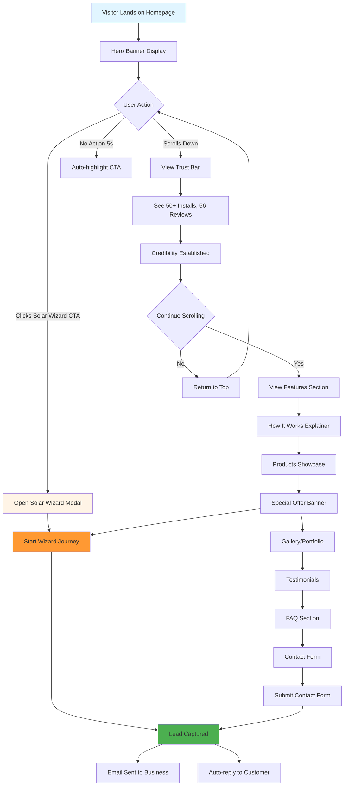
```mermaid
flowchart TD
    A[Visitor Lands on Homepage] --> B[Hero Banner Display]

    B --> C{User Action}

    C -->|Clicks Solar Wizard CTA| D[Open Solar Wizard Modal]
    C -->|Scrolls Down| E[View Trust Bar]
    C -->|No Action 5s| F[Auto-highlight CTA]

    E --> G[See 50+ Installs, 56 Reviews]
    G --> H[Credibility Established]

    H --> I{Continue Scrolling}

    I -->|Yes| J[View Features Section]
    I -->|No| K[Return to Top]

    J --> L[How It Works Explainer]
    L --> M[Products Showcase]
    M --> N[Special Offer Banner]
    N --> O[Gallery/Portfolio]
    O --> P[Testimonials]
    P --> Q[FAQ Section]
    Q --> R[Contact Form]

    D --> S[Start Wizard Journey]
    N --> S
    R --> T[Submit Contact Form]

    S --> U[Lead Captured]
    T --> U

    U --> V[Email Sent to Business]
    U --> W[Auto-reply to Customer]

    K --> C

    style A fill:#e1f5ff
    style D fill:#fff4e6
    style S fill:#ff9933
    style U fill:#4CAF50
```

### Multi-Channel Lead Capture

```mermaid
graph TB
    subgraph "Lead Entry Points"
        A1[Solar Wizard Button]
        A2[Contact Form]
        A3[WhatsApp Float Button]
        A4[AI Chat Widget]
        A5[Special Offer CTA]
        A6[Mobile Contact Bar]
    end

    subgraph "Lead Qualification"
        B[Solar Wizard 5 Steps]
        C[Contact Form Fields]
        D[Chat Conversation]
    end

    subgraph "Lead Storage/Routing"
        E[/api/contact Endpoint]
    end

    subgraph "Lead Delivery"
        F[Email to ultronvij@gmail.com]
        G[Customer Auto-reply]
        H[WhatsApp Deep Link]
    end

    subgraph "CRM/Follow-up"
        I[Manual Follow-up]
        J[WhatsApp Conversation]
    end

    A1 --> B
    A2 --> C
    A3 --> H
    A4 --> D
    A5 --> B
    A6 --> H

    B --> E
    C --> E

    E --> F
    E --> G
    E --> H

    F --> I
    H --> J

    style B fill:#ff9933
    style E fill:#2196F3
    style F fill:#4CAF50
    style H fill:#25D366
```

---

## Solar Wizard Flow

### Complete 5-Step Wizard Journey

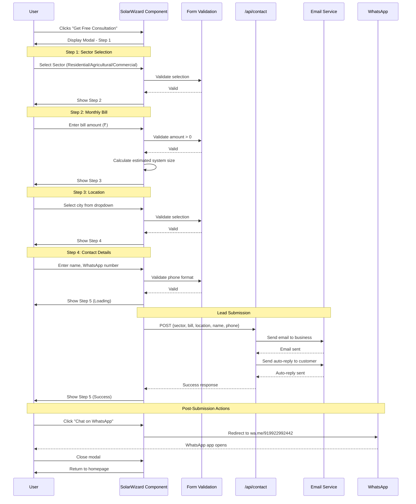
```mermaid
sequenceDiagram
    participant U as User
    participant W as SolarWizard Component
    participant V as Form Validation
    participant A as /api/contact
    participant E as Email Service
    participant WA as WhatsApp

    U->>W: Clicks "Get Free Consultation"
    W->>U: Display Modal - Step 1

    Note over U,W: Step 1: Sector Selection
    U->>W: Select Sector (Residential/Agricultural/Commercial)
    W->>V: Validate selection
    V-->>W: Valid
    W->>U: Show Step 2

    Note over U,W: Step 2: Monthly Bill
    U->>W: Enter bill amount (₹)
    W->>V: Validate amount > 0
    V-->>W: Valid
    W->>W: Calculate estimated system size
    W->>U: Show Step 3

    Note over U,W: Step 3: Location
    U->>W: Select city from dropdown
    W->>V: Validate selection
    V-->>W: Valid
    W->>U: Show Step 4

    Note over U,W: Step 4: Contact Details
    U->>W: Enter name, WhatsApp number
    W->>V: Validate phone format
    V-->>W: Valid
    W->>U: Show Step 5 (Loading)

    Note over W,E: Lead Submission
    W->>A: POST {sector, bill, location, name, phone}
    A->>E: Send email to business
    E-->>A: Email sent
    A->>E: Send auto-reply to customer
    E-->>A: Auto-reply sent
    A-->>W: Success response

    W->>U: Show Step 5 (Success)

    Note over U,WA: Post-Submission Actions
    U->>W: Click "Chat on WhatsApp"
    W->>WA: Redirect to wa.me/919922992442
    WA-->>U: WhatsApp app opens

    U->>W: Close modal
    W->>U: Return to homepage
```

### Solar Wizard State Machine

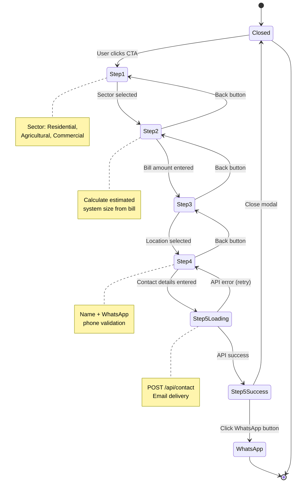
```mermaid
stateDiagram-v2
    [*] --> Closed

    Closed --> Step1: User clicks CTA
    Step1 --> Step2: Sector selected
    Step2 --> Step1: Back button
    Step2 --> Step3: Bill amount entered
    Step3 --> Step2: Back button
    Step3 --> Step4: Location selected
    Step4 --> Step3: Back button
    Step4 --> Step5Loading: Contact details entered
    Step5Loading --> Step5Success: API success
    Step5Loading --> Step4: API error (retry)

    Step5Success --> Closed: Close modal
    Step5Success --> WhatsApp: Click WhatsApp button

    WhatsApp --> [*]
    Closed --> [*]

    note right of Step1
        Sector: Residential,
        Agricultural, Commercial
    end note

    note right of Step2
        Calculate estimated
        system size from bill
    end note

    note right of Step4
        Name + WhatsApp
        phone validation
    end note

    note right of Step5Loading
        POST /api/contact
        Email delivery
    end note
```

### Wizard Form Validation Logic

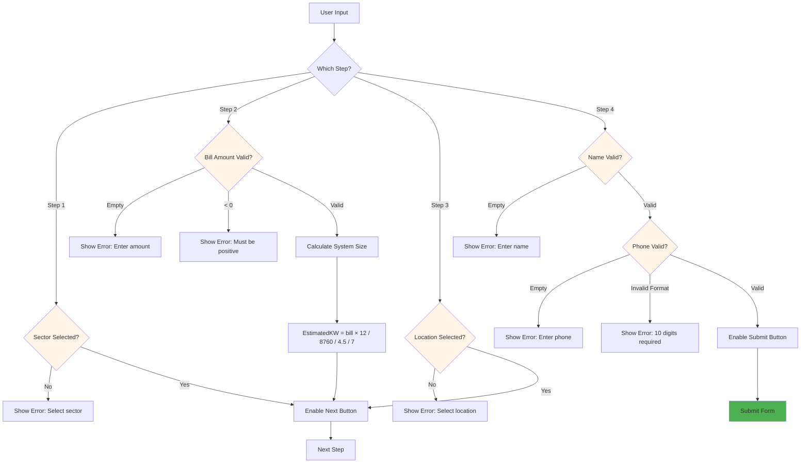
```mermaid
flowchart TD
    A[User Input] --> B{Which Step?}

    B -->|Step 1| C{Sector Selected?}
    C -->|No| D[Show Error: Select sector]
    C -->|Yes| E[Enable Next Button]

    B -->|Step 2| F{Bill Amount Valid?}
    F -->|Empty| G[Show Error: Enter amount]
    F -->|< 0| H[Show Error: Must be positive]
    F -->|Valid| I[Calculate System Size]
    I --> J[EstimatedKW = bill × 12 / 8760 / 4.5 / 7]
    J --> E

    B -->|Step 3| K{Location Selected?}
    K -->|No| L[Show Error: Select location]
    K -->|Yes| E

    B -->|Step 4| M{Name Valid?}
    M -->|Empty| N[Show Error: Enter name]
    M -->|Valid| O{Phone Valid?}
    O -->|Empty| P[Show Error: Enter phone]
    O -->|Invalid Format| Q[Show Error: 10 digits required]
    O -->|Valid| R[Enable Submit Button]

    E --> S[Next Step]
    R --> T[Submit Form]

    style C fill:#fff4e6
    style F fill:#fff4e6
    style K fill:#fff4e6
    style M fill:#fff4e6
    style O fill:#fff4e6
    style T fill:#4CAF50
```

---

## Solar Calculator Flow

### Solar Simulator User Journey

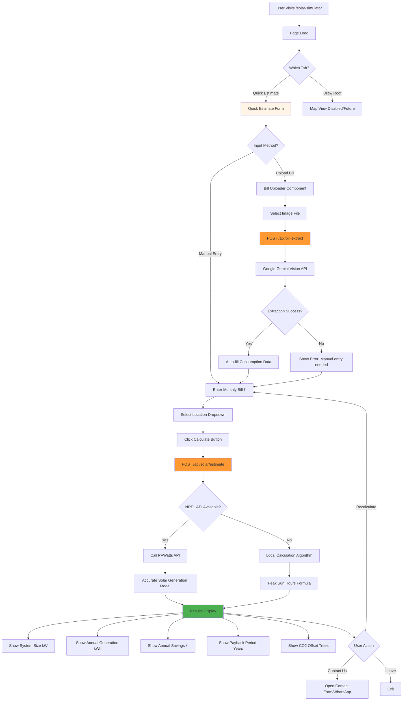
```mermaid
flowchart TD
    A[User Visits /solar-simulator] --> B[Page Load]

    B --> C{Which Tab?}

    C -->|Quick Estimate| D[Quick Estimate Form]
    C -->|Draw Roof| E[Map View Disabled/Future]

    D --> F{Input Method?}

    F -->|Manual Entry| G[Enter Monthly Bill ₹]
    F -->|Upload Bill| H[Bill Uploader Component]

    H --> I[Select Image File]
    I --> J[POST /api/bill-extract]
    J --> K[Google Gemini Vision API]
    K --> L{Extraction Success?}

    L -->|Yes| M[Auto-fill Consumption Data]
    L -->|No| N[Show Error: Manual entry needed]

    M --> G
    N --> G

    G --> O[Select Location Dropdown]
    O --> P[Click Calculate Button]

    P --> Q[POST /api/solar/estimate]
    Q --> R{NREL API Available?}

    R -->|Yes| S[Call PVWatts API]
    R -->|No| T[Local Calculation Algorithm]

    S --> U[Accurate Solar Generation Model]
    T --> V[Peak Sun Hours Formula]

    U --> W[Results Display]
    V --> W

    W --> X[Show System Size kW]
    W --> Y[Show Annual Generation kWh]
    W --> Z[Show Annual Savings ₹]
    W --> AA[Show Payback Period Years]
    W --> AB[Show CO2 Offset Trees]

    W --> AC{User Action}

    AC -->|Contact Us| AD[Open Contact Form/WhatsApp]
    AC -->|Recalculate| G
    AC -->|Leave| AE[Exit]

    style D fill:#fff4e6
    style J fill:#ff9933
    style Q fill:#ff9933
    style W fill:#4CAF50
```

### Bill Extraction Sequence

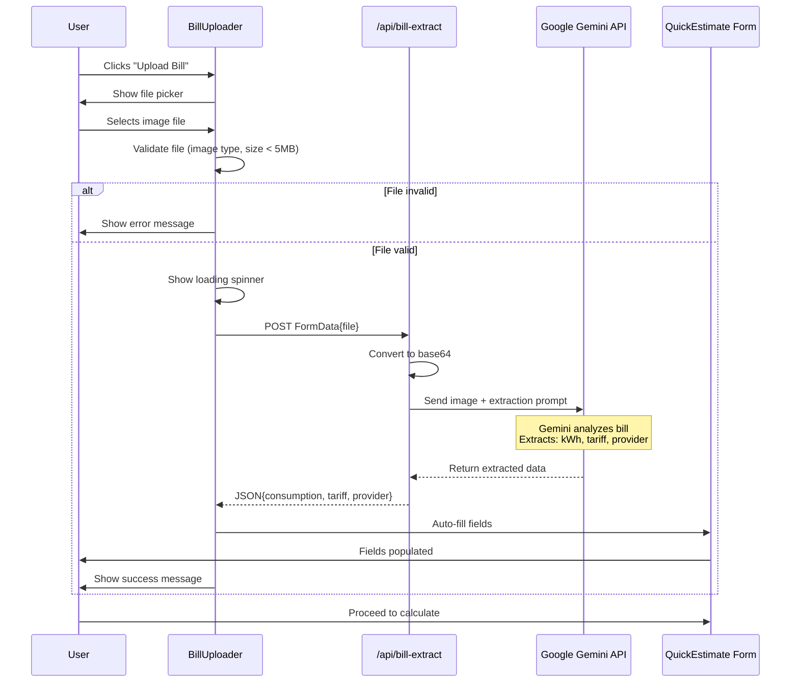
```mermaid
sequenceDiagram
    participant U as User
    participant B as BillUploader
    participant A as /api/bill-extract
    participant G as Google Gemini API
    participant F as QuickEstimate Form

    U->>B: Clicks "Upload Bill"
    B->>U: Show file picker
    U->>B: Selects image file
    B->>B: Validate file (image type, size < 5MB)

    alt File invalid
        B->>U: Show error message
    else File valid
        B->>B: Show loading spinner
        B->>A: POST FormData{file}
        A->>A: Convert to base64
        A->>G: Send image + extraction prompt

        Note over G: Gemini analyzes bill<br/>Extracts: kWh, tariff, provider

        G-->>A: Return extracted data
        A-->>B: JSON{consumption, tariff, provider}

        B->>F: Auto-fill fields
        F->>U: Fields populated
        B->>U: Show success message
    end

    U->>F: Proceed to calculate
```

### Solar Estimation Algorithm

```mermaid
flowchart LR
    A[Input Data] --> B[Monthly Bill ₹]
    A --> C[Location Lat/Lon]

    B --> D[Calculate Annual Consumption]
    D --> E[Annual kWh = Bill × 12 / Tariff Rate]

    C --> F{NREL API?}

    F -->|Available| G[PVWatts API Call]
    F -->|Not Available| H[Lookup Peak Sun Hours]

    G --> I[Get Production Factor]
    H --> J[Peak Sun Hours by Region]
    J --> K[Default: 4.5 hrs/day for Maharashtra]

    E --> L[System Size Calculation]
    I --> L
    K --> L

    L --> M[Size kW = Annual kWh / 365 / Peak Hours / System Efficiency]

    M --> N[Apply System Losses 14%]
    N --> O[Final System Size]

    O --> P[Annual Generation = Size × 365 × Peak Hours × 0.86]
    P --> Q[Annual Savings = Generation × Tariff]
    P --> R[CO2 Offset = Generation × 0.0007 tons/kWh]

    Q --> S[Payback = System Cost / Annual Savings]

    S --> T[Results Output]
    R --> T

    style A fill:#e1f5ff
    style L fill:#fff4e6
    style O fill:#ff9933
    style T fill:#4CAF50
```

---

## AI Chatbot Flow

### Chat Widget Interaction Flow

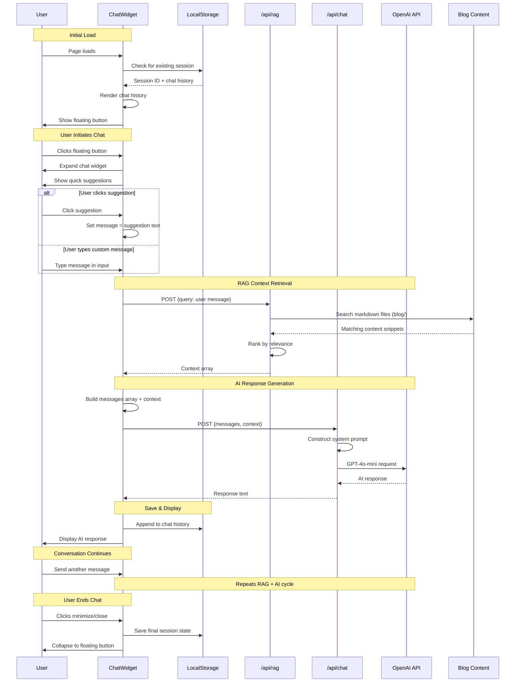
```mermaid
sequenceDiagram
    participant U as User
    participant C as ChatWidget
    participant L as LocalStorage
    participant R as /api/rag
    participant A as /api/chat
    participant O as OpenAI API
    participant B as Blog Content

    Note over U,C: Initial Load
    U->>C: Page loads
    C->>L: Check for existing session
    L-->>C: Session ID + chat history
    C->>C: Render chat history
    C->>U: Show floating button

    Note over U,C: User Initiates Chat
    U->>C: Clicks floating button
    C->>U: Expand chat widget
    C->>U: Show quick suggestions

    alt User clicks suggestion
        U->>C: Click suggestion
        C->>C: Set message = suggestion text
    else User types custom message
        U->>C: Type message in input
    end

    Note over C,O: RAG Context Retrieval
    C->>R: POST {query: user message}
    R->>B: Search markdown files (blog/)
    B-->>R: Matching content snippets
    R->>R: Rank by relevance
    R-->>C: Context array

    Note over C,O: AI Response Generation
    C->>C: Build messages array + context
    C->>A: POST {messages, context}
    A->>A: Construct system prompt
    A->>O: GPT-4o-mini request
    O-->>A: AI response
    A-->>C: Response text

    Note over C,L: Save & Display
    C->>L: Append to chat history
    C->>U: Display AI response

    Note over U,C: Conversation Continues
    U->>C: Send another message
    Note over C,O: Repeats RAG + AI cycle

    Note over U,C: User Ends Chat
    U->>C: Clicks minimize/close
    C->>L: Save final session state
    C->>U: Collapse to floating button
```

### Chat State Machine

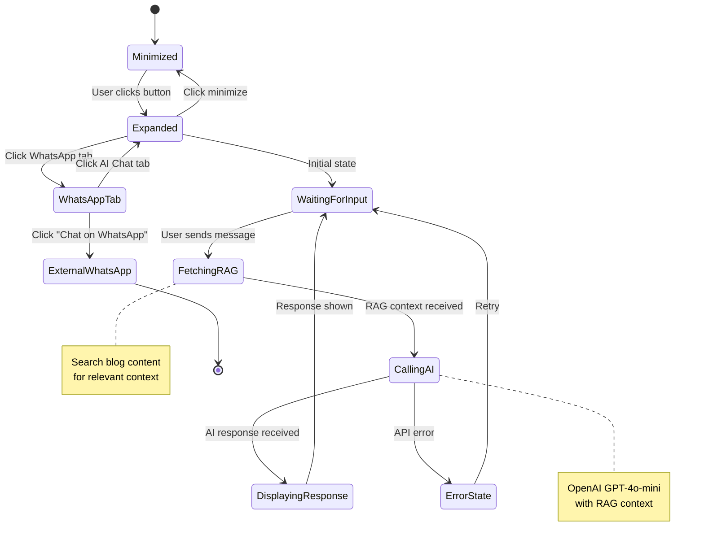
```mermaid
stateDiagram-v2
    [*] --> Minimized

    Minimized --> Expanded: User clicks button
    Expanded --> Minimized: Click minimize

    Expanded --> WaitingForInput: Initial state
    WaitingForInput --> FetchingRAG: User sends message
    FetchingRAG --> CallingAI: RAG context received
    CallingAI --> DisplayingResponse: AI response received
    DisplayingResponse --> WaitingForInput: Response shown

    CallingAI --> ErrorState: API error
    ErrorState --> WaitingForInput: Retry

    Expanded --> WhatsAppTab: Click WhatsApp tab
    WhatsAppTab --> Expanded: Click AI Chat tab

    WhatsAppTab --> ExternalWhatsApp: Click "Chat on WhatsApp"
    ExternalWhatsApp --> [*]

    note right of FetchingRAG
        Search blog content
        for relevant context
    end note

    note right of CallingAI
        OpenAI GPT-4o-mini
        with RAG context
    end note
```

### RAG (Retrieval-Augmented Generation) Process

```mermaid
flowchart TD
    A[User Message] --> B[/api/rag Endpoint]

    B --> C[Load Blog Markdown Files]
    C --> D[Parse Frontmatter & Content]

    D --> E{Matching Strategy}

    E -->|Keyword Match| F[Search in Title]
    E -->|Content Match| G[Search in Body]
    E -->|Tag Match| H[Search in Categories]

    F --> I[Calculate Relevance Score]
    G --> I
    H --> I

    I --> J[Rank Results by Score]
    J --> K{Found Matches?}

    K -->|Yes| L[Return Top 3 Snippets]
    K -->|No| M[Return Empty Context]

    L --> N[Context Array]
    M --> N

    N --> O[/api/chat Receives Context]
    O --> P[Augment System Prompt]
    P --> Q[Include Context: Based on our blog...]
    Q --> R[Send to OpenAI]

    R --> S[Contextually Aware Response]

    style A fill:#e1f5ff
    style B fill:#ff9933
    style I fill:#fff4e6
    style S fill:#4CAF50
```

---

## Contact & Communication Flows

### Contact Form Submission Flow

```mermaid
flowchart TD
    A[User Fills Contact Form] --> B[Enter Name]
    B --> C[Enter Phone]
    C --> D[Enter Email Optional]
    D --> E[Enter Message/Requirement]

    E --> F[Click Submit Button]

    F --> G[Client-Side Validation]
    G --> H{Valid?}

    H -->|No| I[Show Error Messages]
    I --> A

    H -->|Yes| J[Show Loading State]
    J --> K[POST /api/contact]

    K --> L[Server Validation]
    L --> M{Valid?}

    M -->|No| N[Return Error]
    N --> O[Display Error to User]

    M -->|Yes| P[Initialize Nodemailer]
    P --> Q[Connect to Gmail SMTP]

    Q --> R[Send Email to Business]
    R --> S[ultronvij@gmail.com]

    Q --> T{Email Provided?}
    T -->|Yes| U[Send Auto-Reply]
    T -->|No| V[Skip Auto-Reply]

    U --> W[Customer Email]

    S --> X{Email Sent?}
    W --> X

    X -->|Success| Y[Return Success Response]
    X -->|Failed| Z[Return Error Response]

    Y --> AA[Show Success Message]
    AA --> AB[Clear Form]
    AB --> AC[Suggest WhatsApp Contact]

    Z --> AD[Show Retry Option]

    style A fill:#e1f5ff
    style K fill:#ff9933
    style S fill:#4CAF50
    style AA fill:#4CAF50
```

### Multi-Channel Communication Strategy

```mermaid
graph TD
    subgraph "User Contact Points"
        A1[Solar Wizard Submit]
        A2[Contact Form Submit]
        A3[WhatsApp Float Button]
        A4[AI Chat Widget]
        A5[Call Button Header]
        A6[Mobile Contact Bar]
    end

    subgraph "Primary Channels"
        B1[Email]
        B2[WhatsApp]
        B3[Phone Call]
    end

    subgraph "Business Endpoints"
        C1[ultronvij@gmail.com]
        C2[+91 9922992442 WhatsApp]
        C3[+91 9922992442 Voice]
    end

    subgraph "Customer Touchpoints"
        D1[Email Confirmation]
        D2[WhatsApp Chat]
        D3[Phone Conversation]
    end

    A1 --> B1
    A1 --> B2
    A2 --> B1
    A3 --> B2
    A4 --> B2
    A5 --> B3
    A6 --> B2

    B1 --> C1
    B2 --> C2
    B3 --> C3

    C1 --> D1
    C2 --> D2
    C3 --> D3

    style B1 fill:#EA4335
    style B2 fill:#25D366
    style B3 fill:#2196F3
```

### WhatsApp Integration Flow

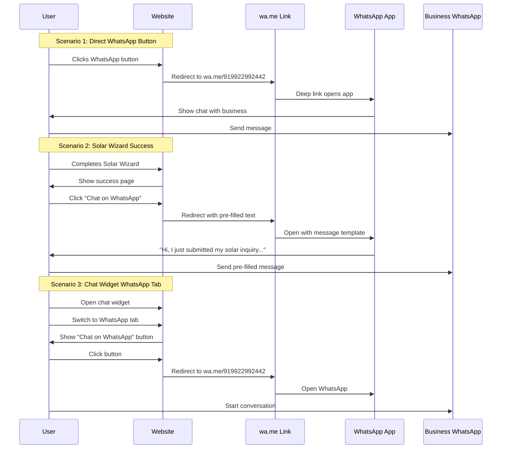
```mermaid
sequenceDiagram
    participant U as User
    participant W as Website
    participant L as wa.me Link
    participant WA as WhatsApp App
    participant B as Business WhatsApp

    Note over U,W: Scenario 1: Direct WhatsApp Button
    U->>W: Clicks WhatsApp button
    W->>L: Redirect to wa.me/919922992442
    L->>WA: Deep link opens app
    WA->>U: Show chat with business
    U->>B: Send message

    Note over U,W: Scenario 2: Solar Wizard Success
    U->>W: Completes Solar Wizard
    W->>U: Show success page
    U->>W: Click "Chat on WhatsApp"
    W->>L: Redirect with pre-filled text
    L->>WA: Open with message template
    WA->>U: "Hi, I just submitted my solar inquiry..."
    U->>B: Send pre-filled message

    Note over U,W: Scenario 3: Chat Widget WhatsApp Tab
    U->>W: Open chat widget
    U->>W: Switch to WhatsApp tab
    W->>U: Show "Chat on WhatsApp" button
    U->>W: Click button
    W->>L: Redirect to wa.me/919922992442
    L->>WA: Open WhatsApp
    U->>B: Start conversation
```

---

## Cookie Consent Flow

### Cookie Banner Interaction Flow

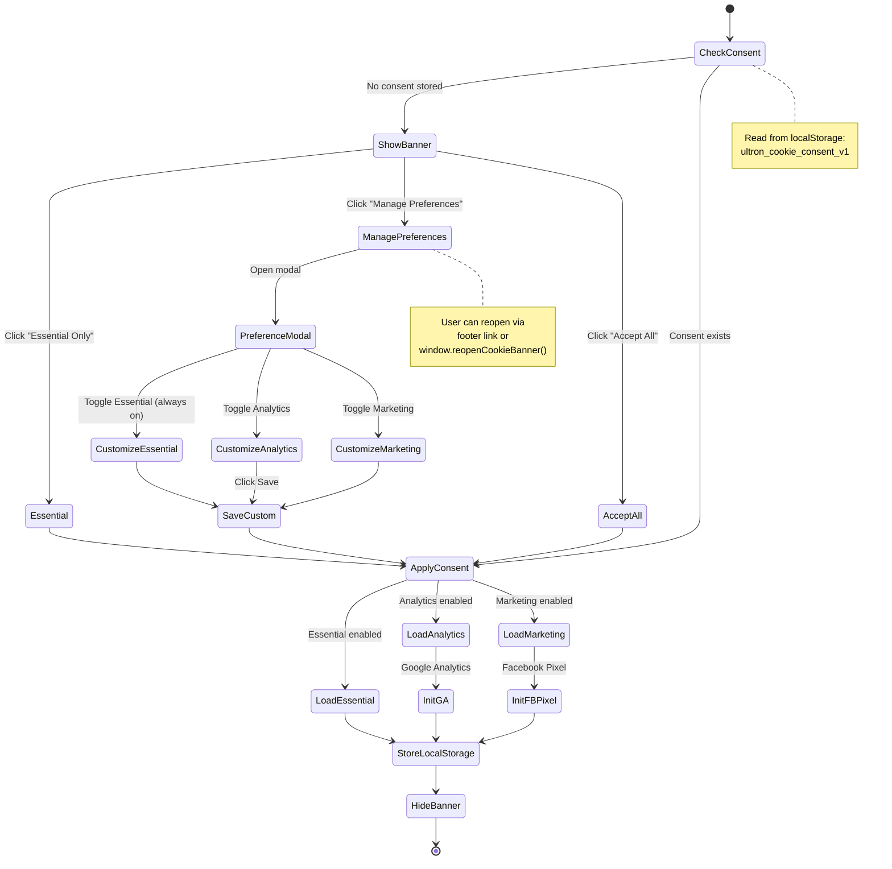
```mermaid
stateDiagram-v2
    [*] --> CheckConsent

    CheckConsent --> ShowBanner: No consent stored
    CheckConsent --> ApplyConsent: Consent exists

    ShowBanner --> Essential: Click "Essential Only"
    ShowBanner --> ManagePreferences: Click "Manage Preferences"
    ShowBanner --> AcceptAll: Click "Accept All"

    ManagePreferences --> PreferenceModal: Open modal
    PreferenceModal --> CustomizeEssential: Toggle Essential (always on)
    PreferenceModal --> CustomizeAnalytics: Toggle Analytics
    PreferenceModal --> CustomizeMarketing: Toggle Marketing

    CustomizeAnalytics --> SaveCustom: Click Save
    CustomizeMarketing --> SaveCustom
    CustomizeEssential --> SaveCustom

    Essential --> ApplyConsent
    AcceptAll --> ApplyConsent
    SaveCustom --> ApplyConsent

    ApplyConsent --> LoadEssential: Essential enabled
    ApplyConsent --> LoadAnalytics: Analytics enabled
    ApplyConsent --> LoadMarketing: Marketing enabled

    LoadEssential --> StoreLocalStorage
    LoadAnalytics --> InitGA: Google Analytics
    LoadMarketing --> InitFBPixel: Facebook Pixel

    InitGA --> StoreLocalStorage
    InitFBPixel --> StoreLocalStorage

    StoreLocalStorage --> HideBanner
    HideBanner --> [*]

    note right of CheckConsent
        Read from localStorage:
        ultron_cookie_consent_v1
    end note

    note right of ManagePreferences
        User can reopen via
        footer link or
        window.reopenCookieBanner()
    end note
```

### Cookie Consent Sequence

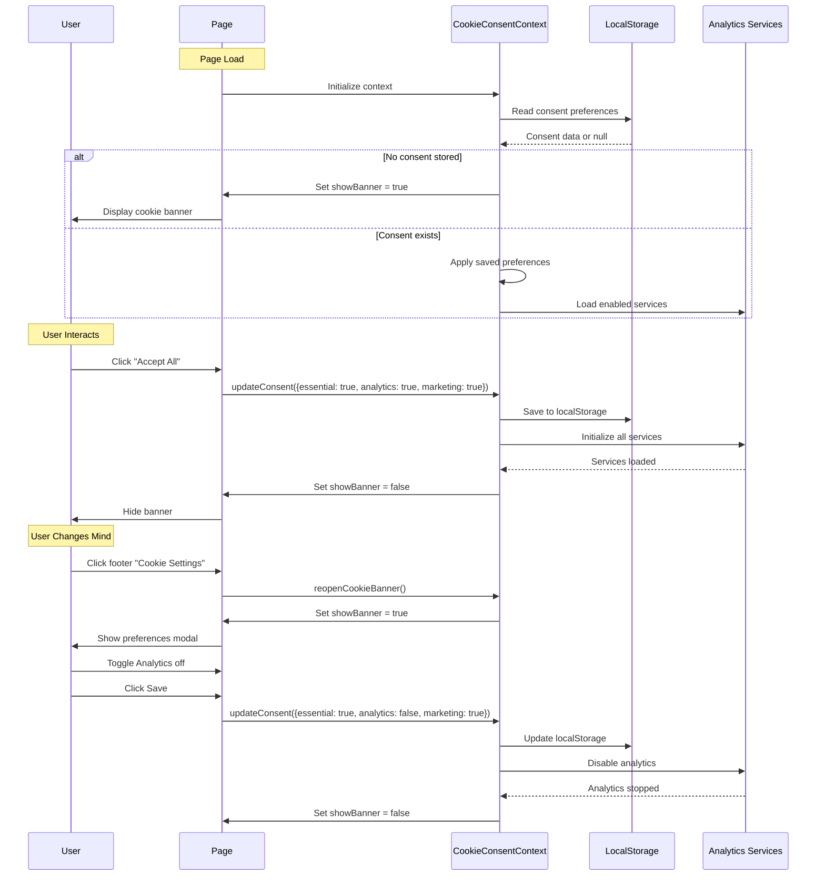
```mermaid
sequenceDiagram
    participant U as User
    participant P as Page
    participant C as CookieConsentContext
    participant L as LocalStorage
    participant A as Analytics Services

    Note over P: Page Load
    P->>C: Initialize context
    C->>L: Read consent preferences
    L-->>C: Consent data or null

    alt No consent stored
        C->>P: Set showBanner = true
        P->>U: Display cookie banner
    else Consent exists
        C->>C: Apply saved preferences
        C->>A: Load enabled services
    end

    Note over U: User Interacts
    U->>P: Click "Accept All"
    P->>C: updateConsent({essential: true, analytics: true, marketing: true})
    C->>L: Save to localStorage
    C->>A: Initialize all services
    A-->>C: Services loaded
    C->>P: Set showBanner = false
    P->>U: Hide banner

    Note over U: User Changes Mind
    U->>P: Click footer "Cookie Settings"
    P->>C: reopenCookieBanner()
    C->>P: Set showBanner = true
    P->>U: Show preferences modal

    U->>P: Toggle Analytics off
    U->>P: Click Save
    P->>C: updateConsent({essential: true, analytics: false, marketing: true})
    C->>L: Update localStorage
    C->>A: Disable analytics
    A-->>C: Analytics stopped
    C->>P: Set showBanner = false
```

---

## Multi-Language Flow

### Language Selection Flow

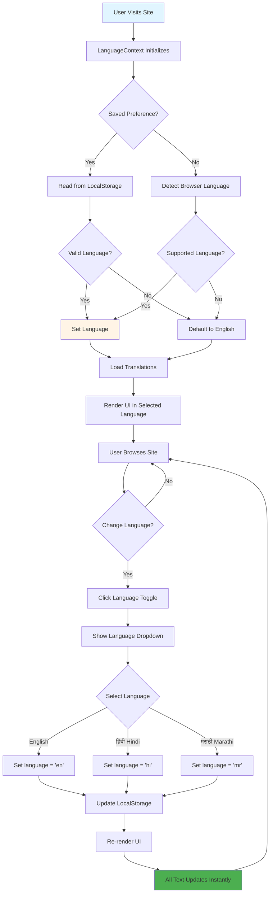
```mermaid
flowchart TD
    A[User Visits Site] --> B[LanguageContext Initializes]

    B --> C{Saved Preference?}

    C -->|Yes| D[Read from LocalStorage]
    C -->|No| E[Detect Browser Language]

    D --> F{Valid Language?}
    E --> G{Supported Language?}

    F -->|Yes| H[Set Language]
    F -->|No| I[Default to English]

    G -->|Yes| H
    G -->|No| I

    H --> J[Load Translations]
    I --> J

    J --> K[Render UI in Selected Language]

    K --> L[User Browses Site]

    L --> M{Change Language?}

    M -->|No| L
    M -->|Yes| N[Click Language Toggle]

    N --> O[Show Language Dropdown]
    O --> P{Select Language}

    P -->|English| Q[Set language = 'en']
    P -->|हिंदी Hindi| R[Set language = 'hi']
    P -->|मराठी Marathi| S[Set language = 'mr']

    Q --> T[Update LocalStorage]
    R --> T
    S --> T

    T --> U[Re-render UI]
    U --> V[All Text Updates Instantly]

    V --> L

    style A fill:#e1f5ff
    style H fill:#fff4e6
    style V fill:#4CAF50
```

### Translation Application Logic

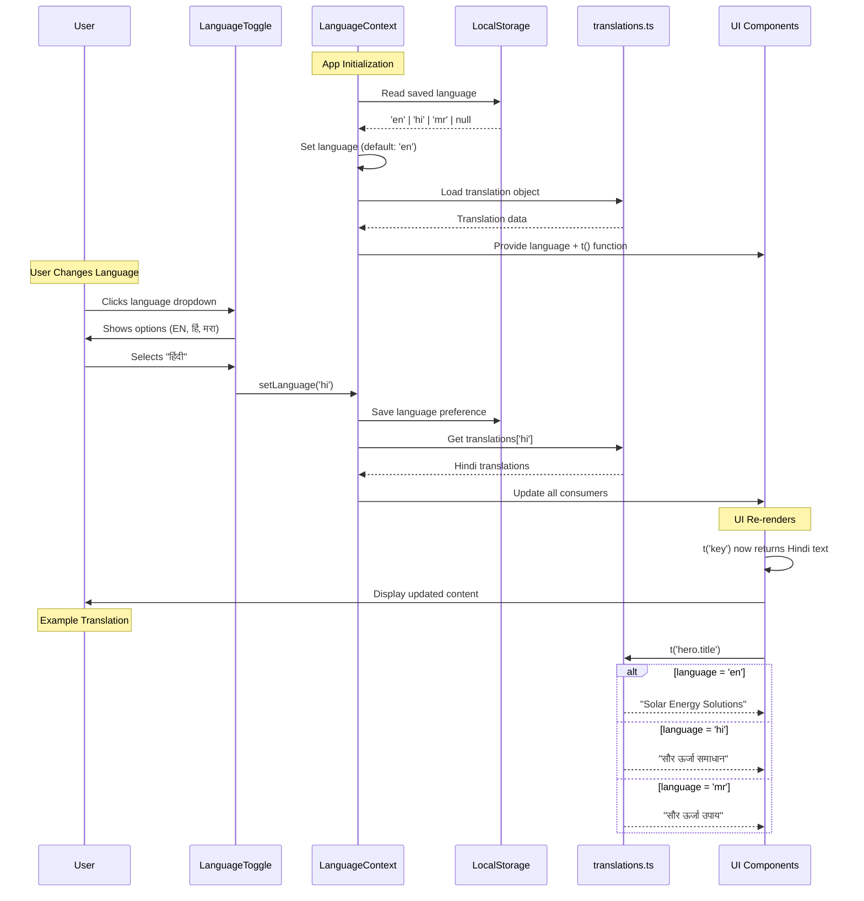
```mermaid
sequenceDiagram
    participant U as User
    participant L as LanguageToggle
    participant C as LanguageContext
    participant S as LocalStorage
    participant T as translations.ts
    participant UI as UI Components

    Note over C: App Initialization
    C->>S: Read saved language
    S-->>C: 'en' | 'hi' | 'mr' | null
    C->>C: Set language (default: 'en')
    C->>T: Load translation object
    T-->>C: Translation data
    C->>UI: Provide language + t() function

    Note over U: User Changes Language
    U->>L: Clicks language dropdown
    L->>U: Shows options (EN, हिं, मरा)
    U->>L: Selects "हिंदी"
    L->>C: setLanguage('hi')
    C->>S: Save language preference
    C->>T: Get translations['hi']
    T-->>C: Hindi translations
    C->>UI: Update all consumers

    Note over UI: UI Re-renders
    UI->>UI: t('key') now returns Hindi text
    UI->>U: Display updated content

    Note over U: Example Translation
    UI->>T: t('hero.title')
    alt language = 'en'
        T-->>UI: "Solar Energy Solutions"
    else language = 'hi'
        T-->>UI: "सौर ऊर्जा समाधान"
    else language = 'mr'
        T-->>UI: "सौर ऊर्जा उपाय"
    end
```

---

## Error Handling Flows

### API Error Handling Strategy

```mermaid
flowchart TD
    A[API Request Initiated] --> B[Fetch API Call]

    B --> C{Response Status}

    C -->|200 OK| D[Parse Response]
    C -->|400 Bad Request| E[Validation Error]
    C -->|429 Too Many Requests| F[Rate Limit Error]
    C -->|500 Server Error| G[Server Error]
    C -->|Network Error| H[Connection Error]

    D --> I{Data Valid?}
    I -->|Yes| J[Success - Update UI]
    I -->|No| K[Data Parse Error]

    E --> L[Show Field Errors]
    F --> M[Show "Please try again" message]
    G --> N[Show "Server issue" message]
    H --> O[Show "Check connection" message]
    K --> P[Show "Unexpected error" message]

    L --> Q{Retry Available?}
    M --> Q
    N --> Q
    O --> Q
    P --> Q

    Q -->|Yes| R[Show Retry Button]
    Q -->|No| S[Show Contact Support]

    R --> T{User Retries}
    T -->|Yes| B
    T -->|No| U[User Exits]

    S --> V[Display Support Contact]
    V --> W[Phone: 9922992442]
    V --> X[Email: ultronvij@gmail.com]

    J --> Y[Continue User Flow]

    style J fill:#4CAF50
    style E fill:#FFC107
    style F fill:#FFC107
    style G fill:#F44336
    style H fill:#F44336
```

### Form Validation Flow

```mermaid
stateDiagram-v2
    [*] --> Pristine

    Pristine --> Touched: User focuses field
    Touched --> Validating: User types
    Validating --> Valid: Validation passes
    Validating --> Invalid: Validation fails

    Valid --> Touched: User modifies
    Invalid --> Touched: User modifies

    Invalid --> ShowError: On blur
    ShowError --> Touched: User focuses again

    Valid --> CanSubmit: All fields valid
    CanSubmit --> Submitting: User clicks submit
    Submitting --> Success: API success
    Submitting --> Failed: API error

    Success --> [*]
    Failed --> CanSubmit: Retry

    note right of Validating
        Client-side rules:
        - Required fields
        - Email format
        - Phone format (10 digits)
        - Min/max length
    end note

    note right of Submitting
        Server-side rules:
        - Sanitize input
        - Validate data types
        - Check business rules
    end note
```

---

## Conclusion

These user flows demonstrate the comprehensive, user-centric design of the UltronSolar platform. Key flow characteristics include:

- **Multiple Conversion Paths**: Users can become leads through wizard, forms, chat, or WhatsApp
- **Progressive Disclosure**: Information revealed step-by-step to reduce cognitive load
- **Intelligent Defaults**: Smart calculations and pre-filled data when possible
- **Graceful Error Handling**: Clear error messages with retry options
- **Multi-Channel Support**: Seamless transitions between email, WhatsApp, and chat
- **Personalization**: Language preferences and saved sessions
- **Mobile Optimization**: Touch-friendly interactions and sticky CTAs

All flows are designed to minimize friction and maximize lead conversion while providing genuine value through tools like the solar calculator and AI chat assistant.
